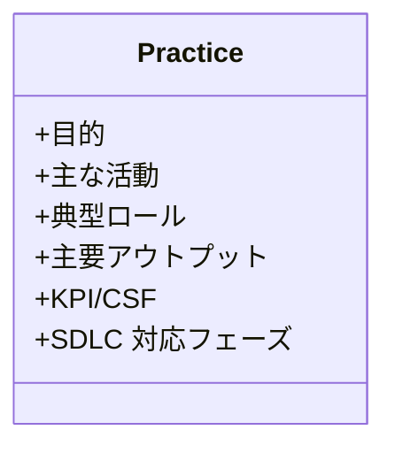

# ITIL 4 一般的マネジメントプラクティス詳細ガイド

# ITIL 4 一般的マネジメントプラクティス詳細ガイド

***

## 1. 本ドキュメントの目的

- **対象**: IT システム開発・導入に携わるプロジェクトマネージャ、アーキテクト、PMO、IT 管理者、および経営層。

- **ゴール**: ITIL 4 の「一般的マネジメントプラクティス」14 種を、システム開発ライフサイクル（SDLC）と結び付けて理解し、実務に適用できるようにする。

- **想定利用シーン**: 新人／中途入社向け ITIL 研修、プロジェクトキックオフ時の共通認識合わせ、継続的改善ワークショップ。

***

## 2. ITIL 4 と一般的マネジメントプラクティスの位置付け

### 2.1 サービス価値システム（SVS）

- **SVS** は組織が価値を共創するための全体像。

- 一般的マネジメントプラクティスは SVS を支える **能力（Capability）** として機能し、サービスバリューチェーン（SVC）の全活動にリソースを供給する。

### 2.2 プラクティス再定義の意義

- 従来 ITIL v3 の「プロセス」→ **プラクティス** へ拡張。

- プロセス（手順）+ 人材 + ツール + パートナーの **4 要素** 全てを包括。

- IT 部門を越え、**全社的なガバナンス枠組み** として活用。

***

## 3. 14 プラクティス徹底解説

以下テンプレートで各プラクティスをまとめる。

### 3.1 アーキテクチャ管理

| 項目         | 内容                                                                                                      |
| ---------- | ------------------------------------------------------------------------------------------------------- |
| **目的**     | 企業全体のビジネス・データ・アプリ・テクノロジー構造を設計し整合性を維持する                                                                  |
| **主な活動**   | 現行・将来アーキ図策定、標準作成、技術ロードマップ更新、設計レビュー                                                                      |
| **典型ロール**  | エンタープライズアーキテクト、ソリューションアーキテクト                                                                            |
| **アウトプット** | アーキテクチャ原則、参照モデル、技術ガードレール                                                                                |
| **KPI**    | 設計例外件数、再作業率、技術負債比率                                                                                      |
| **ツール例**   | Jira / Azure DevOps / Retrium / Confluence Retrospective Macro                                          |
| **SDLC**   | 要件定義でセキュリティ要求作成 → 設計レビュー → CI/CD スキャン → 本番 WAF/EDR 監視 → ポストモーテム & 改善                                    |
| **ツール例**   | Qualys / Nessus / Splunk SIEM / Azure Sentinel / OWASP ZAP / Burp Suite / Snyk / Checkmarx              |
| **ツール例**   | Sparx EA / Archi / Draw\.io / Lucidchart、GitHub・GitLab PR テンプレート、Atlassian Compass、C4 Model ダイアグラムライブラリ |

> **導入 Tips**: レビューを Pull‑Request の必須チェックに組み込むと、現場負担を最小限に自動統制。

***

### 3.2 継続的改善

| 項目         | 内容                                 |
| ---------- | ---------------------------------- |
| **目的**     | 7 ステップモデルで全てのサービス・プラクティスを持続的に改善    |
| **主な活動**   | KPI ベースライン設定、改善バックログ管理、レトロスペクティブ実施 |
| **ロール**    | 継続的改善リーダー、SME 各担当                  |
| **アウトプット** | 改善計画、実施レポート、知識ベース更新                |
| **KPI**    | 完了改善件数、ROI、サイクルタイム                 |
| **SDLC**   | 全フェーズに横串、スプリント単位で小さく回す             |

> **導入 Tips**: Jira / Azure DevOps の **"Improvement" 種別**でチケット管理し、Done 定義に KPI 更新を必須化。

***

### 3.3 情報セキュリティ管理

| 項目         | 内容                                                                                           |
| ---------- | -------------------------------------------------------------------------------------------- |
| **目的**     | 機密性・完全性・可用性 (CIA) を確保し、サービス価値を脅威から保護する                                                       |
| **主な活動**   | セキュリティポリシー策定・周知、リスクベース要件定義、脆弱性管理、アクセス制御、暗号化、監査ログ管理、インシデントレスポンス計画、ペネトレーションテスト、DevSecOps ゲート実装 |
| **典型ロール**  | CISO、セキュリティアーキテクト、SOC アナリスト、DevSecOps エンジニア                                                  |
| **アウトプット** | ISMS 文書、リスク登録簿、脆弱性レポート、インシデント後レビュー、改善プラン                                                     |
| **KPI**    | 重大インシデント件数、平均検知時間 (MTTD)、平均対応時間 (MTTR)、パッチ適用遵守率、セキュリティトレーニング受講率                              |
| **SDLC**   | 要件定義でセキュリティ要求作成 → 設計レビュー → CI/CD スキャン → 本番 WAF/EDR 監視 → ポストモーテム & 改善                         |

> **導入 Tips**: "Shift‑Left" を合言葉に、Pull Request 段階で SAST/DAST 自動スキャンを実施し、脆弱性の "早期検出・早期修正" を徹底する。

***

### 3.4 ナレッジ管理

| 項目         | 内容                                                                                                                                                                                 |
| ---------- | ---------------------------------------------------------------------------------------------------------------------------------------------------------------------------------- |
| **目的**     | 組織内外に散在する情報を集約・体系化し、必要な人が必要な瞬間に知識へアクセスできる状態を実現することで、意思決定と問題解決のスピードを向上させる。                                                                                                          |
| **主な活動**   | - ナレッジ戦略・ガバナンス策定 (KCS® 等の採用)- タクソノミ設計とメタデータ標準化- 知識記事ライフサイクル管理 (作成→レビュー→公開→廃棄)- 検索最適化 / FAQ・チャットボット連携- フィードバック & 評価 (★評価・コメント)- 知識品質監査 (重複・陳腐化チェック)- ナレッジシェア文化促進 (コミュニティ、ランチ&ラーニング) |
| **典型ロール**  | KM マネージャ、ナレッジエンジニア、SME (Subject‑Matter Expert)、サービスデスク分析官、コンテンツレビュア                                                                                                                |
| **アウトプット** | 公開済みナレッジ記事、KEDB (Known Error DB)、トラブルシューティング Runbook、タグ付き FAQ、レポート (デフレクション率など)                                                                                                    |
| **KPI**    | 自己解決率、インシデント再発削減率、記事再利用率、平均記事公開リードタイム、記事品質スコア (レビュー合格率)                                                                                                                            |
| **SDLC**   | **要件定義**: KM 機能 (検索・メタデータ) を非機能要件化 → **設計**: 情報アーキテクチャと API 設計 → **開発/テスト**: KB 記事テンプレート実装、全文検索テスト → **リリース**: 社内／顧客ポータル公開、検索チューニング → **運用**: KEDB 連携、記事 KPI ダッシュボード運用、定期品質レビュー    |
| **ツール例**   | Confluence / Atlassian KB、ServiceNow Knowledge、SharePoint、Zendesk Guide、ElasticSearch、ChatGPT FAQ Bot                                                                              |

> **ベストプラクティス Tip**
>
> - 「記事が使われない＝価値を生まない」ため、**再利用率**や**検索ヒット→クリック率**を重視する。
>
> - KCS® 8 ステップ（Capture ➔ Structure ➔ Reuse ➔ Improve …）を導入すると、サービスデスクの解決時間が 30% 以上短縮した事例も多い。
>
> - 失敗談や障害対応ログを **ポストモーテム** として公開し、継続的改善 (3.2) とリンクさせると学習効果が倍増する。

## 3.5 測定および報告

| 項目         | 内容                                                                                                                                                                                                           |
| ---------- | ------------------------------------------------------------------------------------------------------------------------------------------------------------------------------------------------------------ |
| **目的**     | 組織目標や SLA／SLO と直結する **正しい指標 (KPI/KR)** を設計し、リアルタイム可視化と定期レポートで意思決定を加速させる。                                                                                                                                     |
| **主な活動**   | - 目的→測定→行動がつながる KPI ツリー設計- データ収集設計 (ログ／APM／アンケートなど)- ダッシュボード構築 (リアルタイム & バッチ)- レポーティングサイクル設定 (週次・月次・QBR)- KPI レビュー会で改善アクション合意- データ品質モニタリング (精度・完全性チェック)                                                      |
| **典型ロール**  | Measurement Lead、BI エンジニア、データアナリスト、サービスオーナー、経営層スポンサー                                                                                                                                                         |
| **アウトプット** | KPI カタログ (定義書)、ETL/パイプライン設計書、Power BI／Tableau ダッシュボード、月次パフォーマンスレポート、OKR スコアカード                                                                                                                               |
| **KPI**    | ダッシュボード SLA 達成率、レポート期限遵守率、データ欠損率、KPI→意思決定→改善実行までのリードタイム、意思決定満足度調査                                                                                                                                            |
| **SDLC**   | **Plan**: 成功指標草案作成**Engage**: ステークホルダーと KPI 合意**Design & Transition**: 計測アーキ設計 (OpenTelemetry 等)**Obtain/Build**: 監視エージェント・ETL 実装、テスト**Deliver & Support**: 本番モニタリング & 定例報告**Improve**: KPI 妥当性レビュー→次サイクルへ反映 |
| **ツール例**   | Grafana / Kibana / Datadog / Prometheus / Power BI / Tableau / Looker / Google Data Studio                                                                                                                   |

> **ベストプラクティス Tip**
>
> - **Leading 指標 (先行)** と **Lagging 指標 (結果)** を組み合わせることで、"結果が出る前に手を打つ" 体制を構築できる。
>
> - KPI は <目的> + <数値> + <期限> の 3 要素で文章化し、ダッシュボードと定義書をリンクさせる。
>
> - 四半期ごとに "KPI ハイジーン" を実施し、使われていない指標を棚卸しするとノイズが減り集中力が高まる。

## 3.6 組織変更の管理

| 項目         | 内容                                                                                                                                                                                                                                                                                        |
| ---------- | ----------------------------------------------------------------------------------------------------------------------------------------------------------------------------------------------------------------------------------------------------------------------------------------- |
| **目的**     | 新システム・新プロセス導入時に *「人」* の側面（意識・行動・スキル）を計画的に変革し、定着までを加速させて **投資効果(ROI) を最大化** する。                                                                                                                                                                                                            |
| **主な活動**   | - ステークホルダー分析・影響度マッピング- 変革ビジョン／サクセスストーリー策定- 変更インパクト評価 & レディネス調査- コミュニケーション計画 (Who/What/When/How)- 研修ロードマップ & コンテンツ開発 (LMS 連携)- チェンジチャンピオン・ネットワーク運営- 抵抗マネジメント（フィードバックループ、1on1 コーチ）- 採用・定着 KPI 監視と強化策実行                                                                                      |
| **典型ロール**  | OCM リード (Change Manager)、チェンジスポンサー (経営層)、HRBP、コミュニケーションスペシャリスト、部門チェンジチャンピオン、プロジェクトマネージャ                                                                                                                                                                                                   |
| **アウトプット** | 組織変更管理プラン、影響分析レポート、コミュニケーションカレンダー、FAQ & スクリプト、研修教材 & e‑Learning、レディネスサーベイ結果、採用率ダッシュボード                                                                                                                                                                                                    |
| **KPI**    | システム利用率 (アクティブユーザ/全対象)、研修完了率、サポートチケット数 (リリース後30日)、抵抗インシデント件数、ベネフィット達成率、従業員満足度 (eNPS)                                                                                                                                                                                                      |
| **SDLC**   | **Plan**: ステークホルダー & 影響度分析、OCM 戦略**Engage**: 早期アドボケイト募集、双方向コミュニケーション**Design & Transition**: 変更インパクト詳細評価、研修 & コミュニケーション設計**Obtain/Build**: 研修教材・FAQ・サポートスクリプト作成、UAT で先行体験**Deliver & Support**: Go‑Live カウントダウン、フロアウォークサポート、チャンネル別 Q\&A**Improve**: 採用 KPI レビュー、フォロー研修、Lessons Learned 共有 |
| **ツール例**   | Prosci ADKAR® テンプレート、Microsoft Viva / LMS、SurveyMonkey、Miro (Change Canvas)、Slack / Teams チャンネル、WalkMe / Pendo (デジタル Adoption)                                                                                                                                                            |

> **ベストプラクティス Tip**
>
> 1. **スポンサーの可視的支援** が成功確率を 3 倍高めるとの調査結果。経営層の発信を計画に組み込む。
>
> 2. 研修＝定着ではない。**ADKAR の "Reinforcement"** フェーズを忘れず、Go‑Live 後 90 日のフォローアップを標準化。
>
> 3. 変更抵抗は「声なき声」が 7 割。匿名フィードバックやチャンピオン経由で早期検知し、対処プランを即時実行する。

***

## 3.7 ポートフォリオ管理

| 項目         | 内容                                                                                                                                                                                                                     |
| ---------- | ---------------------------------------------------------------------------------------------------------------------------------------------------------------------------------------------------------------------- |
| **目的**     | すべてのサービス・プロダクト・プロジェクト投資を **戦略・価値・リスク・リソース** の観点で最適化し、経営資源を最も価値の高い取り組みに集中させる。                                                                                                                                           |
| **主な活動**   | - ポートフォリオガバナンス設計 (ガイドライン・承認フロー)- 投資インテークプロセス (アイデア→提案→ビジネスケース)- 価値対リスク評価 (VRT 4象限, WSJF, MoSCoW 等)- 予算／キャパシティシナリオ分析 (人員・資金ロードマップ)- ポートフォリオカンバンで WIP 管理・トリアージ- 四半期レビュー (実績・戦略整合チェック、リバランス)- サンセット (非効率サービス/プロダクトの整理・廃止) |
| **典型ロール**  | ポートフォリオマネージャ、PMO ディレクタ、CFO/ファイナンス担当、サービスオーナー、エンタープライズアーキテクト、ステアリングコミッティ                                                                                                                                                |
| **アウトプット** | 承認済みポートフォリオリスト、投資ロードマップ、予算配分表、価値‑リスクヒートマップ、ポートフォリオステータスレポート、廃止計画                                                                                                                                                       |
| **KPI**    | 戦略整合率 (OKR 連動 %)、投資対効果 (NPV/IRR)、リソース充足率、ポートフォリオバランス指標 (Run/Grow/Transform 比率)、案件承認リードタイム、廃止によるコスト削減額                                                                                                                  |
| **SDLC**   | **Plan**: アイデア収集→価値評価→バックログ登録**Engage**: ステークホルダーと ROI/リスク協議**Design & Transition**: リソース計画と依存分析**Obtain/Build**: 進行案件モニタリング、予算調整**Deliver & Support**: ベネフィット実現状況レビュー**Improve**: 四半期リバランス、非効率投資の整理                   |
| **ツール例**   | Jira Align / Advanced Roadmaps、Azure DevOps Portfolio、ServiceNow PPM、Planview、Aha! Roadmaps、Lean Portfolio Kanban (Miro, Jira)、Power BI ポートフォリオダッシュボード                                                                 |

> **ベストプラクティス Tip**
>
> 1. **Lean Portfolio Management** の 3 つのガードレール (資金供給・ガバナンス・WIP 制限) を採用し、承認から着手までのリードタイムを 50% 以上短縮した事例が多い。
>
> 2. "Run‑Grow‑Transform" または "Horizon 1‑2‑3" マッピングでバランスを可視化し、経営層の意思決定を支援。
>
> 3. ポートフォリオカンバンに **WIP Limit** を設定すると、過負荷による多重プロジェクト遅延を防止できる。

***

## 3.8 プロジェクト管理

| 項目         | 内容                                                                                                                                                                                                                                                                                                                                        |
| ---------- | ----------------------------------------------------------------------------------------------------------------------------------------------------------------------------------------------------------------------------------------------------------------------------------------------------------------------------------------- |
| **目的**     | 予算・スコープ・品質・リスクを統合管理し、**ビジネス価値を期限どおりに提供** する。ITIL では“価値を共創するバリューストリーム”の実行エンジンとして機能する。                                                                                                                                                                                                                                                      |
| **主な活動**   | - プロジェクト憲章 (目的・成功基準・スポンサー) 作成- WBS／バックログ分解と優先順位付け (MoSCoW, WSJF)- タスク見積り & キャパシティ計画 (ストーリーポイント / 工数)- スケジュール策定 (ガント / レリースバーンダウン)- コスト & 予算管理 (EVM, CPI/SPI)- リスク & 課題管理 (RAID ログ更新)- ステークホルダーコミュニケーション (定例会・レポート)- 変更管理 (スコープクリープ防止、インパクト分析)- 品質保証 (ゲートレビュー、DoD / DOR 定義)- ベロシティ & バーンアップ分析で予実比較- プロジェクト終結レビュー (Lessons Learned, 実績 KPI) |
| **典型ロール**  | プロジェクトマネージャ (PM)、スクラムマスター、プロダクトオーナー、開発リーダー、QA リーダー、PMO アナリスト、スポンサー                                                                                                                                                                                                                                                                        |
| **アウトプット** | プロジェクト計画書、スプリント計画 & レトロ、WBS / バックログ、リスクログ、ステータスレポート、EVM グラフ、受入判定書、成果物移管ドキュメント、Lessons Learned 報告書                                                                                                                                                                                                                                         |
| **KPI**    | 納期遵守率 (OTD)、バーンダウン vs 実績差分、コストパフォーマンス指数 (CPI)、リソース稼働率、欠陥密度、顧客満足度 (CSAT)、計画対比 ROI                                                                                                                                                                                                                                                          |
| **SDLC**   | **Plan**: プロジェクト憲章・WBS 草案**Engage**: ステークホルダー調整、コミュニケーション計画**Design & Transition**: フェーズ／スプリント計画、品質ゲート定義**Obtain/Build**: タスク実行、進捗・品質・リスクモニタリング (デイリースタンドアップ・かんばん)**Deliver & Support**: ユーザ受入テスト (UAT) サポート、切替リハーサル、運用受入**Improve**: プロジェクトレトロ & Lessons Learned、ベロシティ改善策を継続的改善 (3.2) へ連携                                                |
| **ツール例**   | Jira Software / Azure Boards / Trello (かんばん & バックログ)、MS Project / Primavera (ガント)、Confluence (計画書 & レトロ)、EVM ダッシュボード (Power BI)、Slack / Teams (コミュニケーション)                                                                                                                                                                                 |

> **ベストプラクティス Tip**
>
> 1. **ハイブリッド PM**: 要件定義〜設計はフェーズ制御 (ウォーターフォール)、開発〜テストは 2 週間スプリント (Scrum) を採用し、“変更に強い計画性” を両立。
>
> 2. **EVM + ベロシティ** の二軸管理でコスト & スケジュール健全性を可視化。CPI/SPI < 0.9 はリスク信号として RAID ログに自動登録。
>
> 3. DoR/DoD を**ナレッジ管理 (3.4)** のテンプレに格納し、プロジェクト横断で再利用すると品質ゲートのばらつきを抑制できる。

## 3.9 関係管理

| 項目         | 内容                                                                                                                                                                                                                                                                  |
| ---------- | ------------------------------------------------------------------------------------------------------------------------------------------------------------------------------------------------------------------------------------------------------------------- |
| **目的**     | 顧客・ユーザ・パートナー・経営層など **すべてのステークホルダーとの信頼関係** を構築・維持し、価値共創を加速させる。期待値ギャップを最小化し、協働によるサービス改善を促進する。                                                                                                                                                                         |
| **主な活動**   | - ステークホルダー識別 & マッピング (パワー‑関心マトリクス) - エスカレーションパス & コミュニケーションチャネル設計 - SLA / OLA / UC 交渉・合意・レビュー - ガバナンス会議 (QBR, CAB, ECAB) ファシリテート - 顧客満足度 (CSAT/NPS) 調査 & VOC 分析 - 関係健全度 KPI モニタリング & 改善イニシアチブ実施 - 重大インシデント時の関係調整・情報共有 - 契約更新・拡張提案に向けた価値実証 (Success Story, ROI レポート) |
| **典型ロール**  | リレーションシップマネージャ (BRM)、サービスオーナー、アカウントマネージャ、カスタマーサクセスマネージャ、エグゼクティブスポンサー、サプライヤマネージャ                                                                                                                                                                                     |
| **アウトプット** | ステークホルダーマトリクス、RACI チャート、コミュニケーションカレンダー、エスカレーションチェーン図、QBR 議事録 & アクションリスト、CSAT/NPS レポート、改善ロードマップ、契約更新提案書                                                                                                                                                              |
| **KPI**    | ステークホルダー満足度スコア、苦情対応平均リードタイム、SLA/OLA 遵守率、ガバナンス会議開催率、契約継続率 (チャーン率逆数)、拡張/アップセル率、共同改善件数                                                                                                                                                                                 |
| **SDLC**   | **Plan**: ステークホルダー識別 & 目標整合  **Engage**: 期待値調整、SLA 草案共有  **Design & Transition**: サービス仕様レビュー、コミュニケーション計画確定  **Obtain/Build**: 開発進捗共有、受入テスト参加調整 **Deliver & Support**: 運用ガバナンス、定例報告、エスカレーション対応  **Improve**: VOC → 改善バックログ化、共同ロードマップ策定                               |
| **ツール例**   | Salesforce / HubSpot CRM、ServiceNow BRM、Miro Stakeholder Map、Confluence SLA スペース、Teams / Slack ガバナンスチャネル、SurveyMonkey / Qualtrics NPS ダッシュボード                                                                                                                       |

> **ベストプラクティス Tip**
>
> 1. **Single Point of Contact (SPOC)** を明確化し、問い合わせ迷子を防ぐ。
>
> 2. 四半期ごとの **QBR** で価値実績 & ロードマップを可視化し、「成果→次の投資」をスムーズに合意。
>
> 3. **Voice of Customer (VoC)** プログラムで定性フィードバックを収集し、継続的改善 (3.2) バックログへ直結させる。

***

## 3.10 リスク管理

| 項目            | 内容                                                                                                                                                                                                                                                                                                                |
| ------------- | ----------------------------------------------------------------------------------------------------------------------------------------------------------------------------------------------------------------------------------------------------------------------------------------------------------------- |
| **目的**        | 目標達成を脅かす不確実性（脅威・機会）を体系的に **識別・評価・対応・監視** し、リスク曝露を最適許容範囲内に制御することで、サービス価値とレジリエンスを確保する。                                                                                                                                                                                                                              |
| **主な活動**      | - リスクマネジメントフレーム策定 (方針・役割・許容度)- リスク識別ワークショップ (PESTLE, SWOT, FMEA, STRIDE など)- 定量/定性評価 (影響×発生確率 = リスクスコア、Monte Carlo、VaR)- リスク対応策選択 (回避・軽減・転嫁・受容)- リスク登録簿 (RAID Log) 更新とオーナー割当- KPI & しきい値 (KRIs) 設定、Early Warning 指標監視- 変更/インシデント時のリスク再評価、レトロスペクティブ- 定期レビュー & エグゼクティブ報告 (月次/四半期)                                   |
| **典型ロール**     | リスクマネージャ、CRO/CISO、PM/PO、シニアアーキテクト、ファシリテータ (モデレーター)、監査チーム                                                                                                                                                                                                                                                          |
| **アウトプット**    | リスクマネジメント計画書、リスク登録簿 (Excel/Jira)/ヒートマップ、対応アクションプラン、KRIs ダッシュボード、リスク承認記録、レポート (リスクプロファイル、トレンド分析)                                                                                                                                                                                                                   |
| **KPI / KRI** | 残余リスク件数と合計スコア、期限超過リスク率、軽減策完了率、重大インシデント発生率、自己評価成熟度 (CMMI / ISO 31000)，リスク→課題転化件数                                                                                                                                                                                                                                   |
| **SDLC 対応**   | **Plan**: 企業/プロダクトリスクアペタイト設定、フレーム確立**Engage**: ステークホルダーからリスク仮説収集、契約・規制要求チェック**Design & Transition**: アーキ・プロセス レビューで技術/運用リスク識別、セキュリティ/可用性設計評価**Obtain/Build**: スプリント終了ごとにリスクレビュー、テスト結果で影響再計算**Deliver & Support**: 本番障害/変更に伴うリスクログ更新、運用 KRI 監視 (MTTR, SLO 達成度)**Improve**: ポストモーテム→根本原因をリスク登録簿へフィードバック、傾向分析で新リスク予測 |
| **ツール例**      | Jira Risk / RAID プラグイン、Microsoft Risk Manager、ServiceNow GRC、Risk Register (Excel/Sheets)、Monte Carlo (Palisa...                                                                                                                                                                                                  |

## 3.11 サービス財務管理

| 項目          | 内容                                                                                                                                                                                                                                                              |
| ----------- | --------------------------------------------------------------------------------------------------------------------------------------------------------------------------------------------------------------------------------------------------------------- |
| **目的**      | IT サービスの **コスト・収益・投資** を可視化し、ビジネス価値に見合った資源配分と価格設定を行うことで、経営判断と継続的改善を支援する。                                                                                                                                                                                        |
| **主な活動**    | - TCO / ROI / NPV / IRR 試算 (ビジネスケース作成) - 予算計画 & 承認 (CAPEX / OPEX 内訳) - コスト追跡 & 予実差異分析 (EAC, ETC) - ショーバック / チャージバック モデル設計・運用 - 単価モデル作成 (CPU 時間・ストレージ GB・ユーザ数など) - サービス価格設定 & カタログ反映 - 原価削減 & 最適化イニシアチブ (クラウドコスト, ライセンス統合) - 財務レポーティング (月次/四半期/年度) & CFO ブリーフィング |
| **典型ロール**   | サービス財務マネージャ (ITFM)、CFO/FP\&A、サービスオーナー、ポートフォリオマネージャ、資産管理アナリスト、FinOps チーム                                                                                                                                                                                         |
| **アウトプット**  | ビジネスケース文書、予算要求書、コストセンター台帳、ショーバックレポート、チャージバック請求書、単価カード、コスト最適化提案書、財務 KPI ダッシュボード                                                                                                                                                                                  |
| **KPI**     | 予算遵守率 (Actual / Budget)、単価精度 (±% 誤差)、サービス粗利率、コスト回収率、ROI 達成度、FinOps Maturity スコア、コスト削減額                                                                                                                                                                          |
| **SDLC 対応** | **Plan**: ビジネスケース & 予算計画**Engage**: ステークホルダーとコスト‑価値整合 **Design & Transition**: 原価モデル詳細設計、CAPEX 取得計画 **Obtain/Build**: 支出認識 (資産計上/減価償却)、コスト追跡**Deliver & Support**: OPEX モニタリング、ショーバック/請求処理**Improve**: コスト最適化レビュー、単価モデル更新、予算リプランニング                             |
| **ツール例**    | Apptio / TBM Suite、ServiceNow ITBM / ITFM、CloudHealth、AWS Cost Explorer、Anaplan、Excel + Power BI、Oracle ERP Cloud                                                                                                                                               |

> **ベストプラクティス Tip**
>
> 1. **TBM (Technology Business Management)** フレームワークを採用し、"Plan‑Build‑Run" コストを可視化すると、経営層の IT 投資理解が飛躍的に向上。
>
> 2. クラウドでは **FinOps** プラクティス (Allocate → Optimise → Operate) を併用し、タグ付け & アラートで“使われていないリソース”を自動検出→削除。
>
> 3. チャージバック導入前に **ショーバック** で透明性を高め、部門間信頼を築くステップを踏むと抵抗が少ない。

## 3.12 戦略管理

| 項目          | 内容                                                                                                                                                                                                                                                                     |
| ----------- | ---------------------------------------------------------------------------------------------------------------------------------------------------------------------------------------------------------------------------------------------------------------------- |
| **目的**      | 組織ビジョン・ミッションを実現するために **長期～中期の方向性と優先事項** を定め、IT・サービス投資を戦略的に整合させる。SVS 全体の“北極星 (North Star)” を示す。                                                                                                                                                                         |
| **主な活動**    | - 外部環境分析 (PESTLE、Five Forces、SWOT) - ビジョン・ミッション見直しと **戦略テーマ** 抽出 - 目標・成果指標の設定 (OKR / OGSM / Hoshin Kanri) - サービス価値システム (SVS) とバリューチェーンへのマッピング - 戦略ロードマップ & イニシアチブバックログ策定 (3〜5 年) - KPI & CSF 定義、バランストスコアカード作成 - 年次計画サイクル (ポートフォリオレビューと連携) - 戦略実行レビュー (QBR/MBR) とピボット判断 |
| **典型ロール**   | CIO / CTO / CDO、戦略企画ディレクタ、エンタープライズアーキテクト、ポートフォリオマネージャ、ファイナンスパートナー、BRM (Business Relationship Manager)                                                                                                                                                                  |
| **アウトプット**  | 戦略ビジョンステートメント、戦略テーマ & エピック一覧、OKR シート、戦略ロードマップ (ガント/ビジュアル)、SVS‑SVC マッピング図、戦略 KPI ダッシュボード、戦略リスクレジスター                                                                                                                                                                     |
| **KPI**     | 戦略目標達成率 (OKR %)、戦略投資比率 (Transform/Grow vs Run)、戦略イニシアチブ完了率、期待 ROI 達成度、従業員理解度 (戦略サーベイ)、戦略レビュー遵守率                                                                                                                                                                        |
| **SDLC 対応** | **Plan**: ビジョン & 戦略テーマ策定**Engage**: ステークホルダー合意形成、価値定義**Design & Transition**: 戦略要件→ロードマップ→アーキ青写真に展開**Obtain/Build**: 戦略イニシアチブをプロジェクト/プロダクトバックログへ分解**Deliver & Support**: KPI 進捗モニタリング、戦略的 SLO 追跡**Improve**: 四半期 / 年次戦略レビューでピボット・改善案をポートフォリオ (3.7) と CI (3.2) へ連携      |
| **ツール例**    | Aha! Roadmaps / Productboard、Balanced Scorecard (BSC) ワークシート、Microsoft Strategy Scorecards、OKR ソフト (Gtmhub, Profit.co)、Miro / FigJam 戦略キャンバス、Power BI 戦略 KPI ボード                                                                                                       |

> **ベストプラクティス Tip**
>
> 1. **“Start where you are”**: 既存 KPI と実績データを起点に次年度 OKR を設計すると、目標現実性が高まりチーム納得度が向上。
>
> 2. **ビジュアル化**: 1 ページの **Strategy Map** にテーマ→目的→指標→イニシアチブを紐付けると、他部門との対話がスムーズ。
>
> 3. **連携ループ**: 戦略‐ポートフォリオ (3.7)‐財務 (3.11) の 3 角連携を四半期ごとにチェックすると、投資のミスアラインメントを早期是正できる。

***

## 3.13 サプライヤ管理

| 項目          | 内容                                                                                                                                                                                                                                                                     |
| ----------- | ---------------------------------------------------------------------------------------------------------------------------------------------------------------------------------------------------------------------------------------------------------------------- |
| **目的**      | クラウド・SaaS・ハードウェア・外部開発ベンダなど **外部供給者との契約・パフォーマンス・リスク**を統合管理し、コスト効率とサービス品質を最大化する。                                                                                                                                                                                         |
| **主な活動**    | - サプライヤ戦略 & セグメンテーション (戦略/戦術/補完)- RFI/RFP 発行、ベンダ評価 (技術・財務・セキュリティ)- 契約 & SLA / OLA 締結、価格・条件交渉- オンボーディング (セキュリティ・コンプラ研修、アカウント発行)- KPI / SLA モニタリング & 四半期ビジネスレビュー (QBR)- パフォーマンススコアカード発行、改善要求 (SCAR) 対応- リスク & コンプライアンス監査 (第三者レポート、BCP、ESG)- 更新 / 再交渉 / 退出 (Exit) 計画 & 実行 |
| **典型ロール**   | サプライヤマネージャ、調達/購買担当、契約マネージャ、法務、サービスオーナー、情報セキュリティ、経営スポンサー                                                                                                                                                                                                                |
| **アウトプット**  | 承認済みベンダリスト (AVL)、契約書 & 付属 SLA/OLA、ベンダパフォーマンスレポート、改善要求 (RFI/SCAR) ログ、リスク登録簿、退出計画書                                                                                                                                                                                       |
| **KPI**     | SLA 遵守率、納期遵守率、重大インシデント件数、コスト変動率 (Actual vs Contract)、契約更新リードタイム、ベンダリスクスコア、サプライヤ満足度 (VSM)                                                                                                                                                                               |
| **SDLC 対応** | **Plan**: ソーシング戦略・要件策定**Engage**: RFP & 評価、契約交渉**Design & Transition**: セキュリティ & サービス移行要件合意、オンボーディング**Obtain/Build**: サプライヤ成果物受入、共同レビュー**Deliver & Support**: SLA 監視、QBR、問題/変更エスカレーション**Improve**: パフォーマンス改善、再交渉・退出、ベンダ開発プログラム                                         |
| **ツール例**    | ServiceNow Vendor Management, SAP Ariba, Coupa, Jira Vendor Scorecard, Excel/Power BI Dashboard, DocuSign CLM                                                                                                                                                          |

> **ベストプラクティス Tip**
>
> 1. **多重ベンダ vs 戦略的パートナー**: 重要度と切替コストをヒートマップ化し、冗長化と集中投資をバランスさせる。
>
> 2. **早期警告**: SLA 違反予兆 (MTTR 上昇など) をキャッチする Leading KPI を設定し、重大障害を未然防止。
>
> 3. **退出計画** を契約段階で定義し、ロックイン & サービス停止リスクを最小化。

## 3.14 要員およびタレント管理

| 項目          | 内容                                                                                                                                                                                                                                                                                                                     |
| ----------- | ---------------------------------------------------------------------------------------------------------------------------------------------------------------------------------------------------------------------------------------------------------------------------------------------------------------------- |
| **目的**      | 必要なスキル・人数をタイムリーに確保し、**採用 → 育成 → 定着 → リスキリング** のサイクルで組織能力を継続的に強化する。ITIL の "Optimize and Automate" 原則を“人材”に適用し、変化に強いチームを作ることがゴール。                                                                                                                                                                                        |
| **主な活動**    | - 人員計画 (ヘッドカウント & スキル需要予測)- 職務記述書 (JD) & スキルマトリクス整備- 採用プロセス (求人票→面接→オファー) と採用チャネル最適化 (リファラル, SNS, ATS)- オンボーディング & メンタリングプログラム (90 日計画)- パフォーマンス & OKR 評価、フィードバック面談 (1‑on‑1)- 学習 & 開発 (LMS、資格支援、Tech ブートキャンプ)- キャリアパス & サクセッションプラン (昇進/ローテーション)- エンゲージメント向上施策 (報酬、福利厚生、働き方柔軟性)- リスキリング & クロススキリング (クラウド、AI/ML、セキュリティ等) |
| **典型ロール**   | HRBP、タレントマネージャ、L\&D リード、ラインマネージャ、テックリード、メンター、従業員代表、CPO (People Officer)                                                                                                                                                                                                                                                |
| **アウトプット**  | スキルマトリクス & ギャップ分析レポート、採用 KPI ダッシュボード、オンボーディングキット、OKR 評価シート、L\&D カリキュラム、キャリアパス文書、エンゲージメントサーベイ結果、リスキリング計画書                                                                                                                                                                                                               |
| **KPI**     | 充足率 (採用完了/計画)、Time‑to‑Hire、オンボーディング完了率、離職率/定着率、学習完了率、従業員エンゲージメントスコア (eNPS)、スキルギャップ解消率                                                                                                                                                                                                                                  |
| **SDLC 対応** | **Plan**: スキル需要予測, JD 更新**Engage**: 採用ブランディング, 候補者体験改善**Design & Transition**: オンボーディングカリキュラム設計, メンター割り当て**Obtain/Build**: チーム編成, L\&D 実施, クロススキル開発**Deliver & Support**: 1‑on‑1, OKR 評価, エンゲージメント施策**Improve**: スキルマップ & ギャップ再評価, リスキリング計画更新                                                                          |
| **ツール例**    | Workday / SAP SuccessFactors, Greenhouse ATS, LinkedIn Talent Insights, Degreed / Coursera (LMS), 15Five / CultureAmp (eNPS), Power BI HR ダッシュボード                                                                                                                                                                      |

> **ベストプラクティス Tip**
>
> 1. **“Build‑Buy‑Borrow”** 戦略でスキル獲得オプション (内製, 採用, 外部委託) を比較し、TCO とスピードを最適化。
>
> 2. OKR にスキル獲得 KPI を組み込み、業務成果と学習成果を結び付けると学習定着率が向上。
>
> 3. **リスキリングファンド** を設け、従業員が自律的にスキルアップ計画を提案→承認→実行できる仕組みを提供すると、技術変化への適応が早まる。

***

## 4. まとめと次のアクション

- 14 プラクティスは単独ではなく **相互依存**。RACI と KPI で接点を明確化し、SVS 全体最適を指向する。

- 本ドキュメントをベースに **①現状成熟度アセスメント → ②優先課題のプラクティス強化ロードマップ → ③定量的 KPI 追跡** の 3 ステップで展開すると効果的。

- 詳細テンプレートやツール例は附属リポジトリに格納済み。各チームは自部門コンテキストに合わせてカスタマイズし、次回レビューで成果と Lessons Learned を共有すること。
