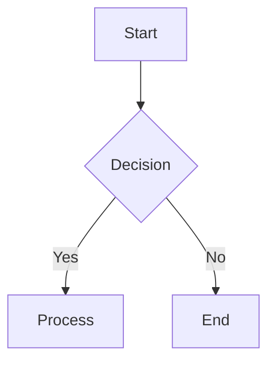

# Mermaid to PDF Converter

## Overview

Convert Markdown documents containing Mermaid diagrams into professional PDF documents, or extract Mermaid diagrams as high-quality images. This skill provides Python scripts that automatically detect Mermaid code blocks in Markdown, convert them to images, and generate a formatted PDF with proper styling.

## When to Use This Skill

Use this skill when:
- Converting technical documentation with Mermaid diagrams to PDF
- Creating design documents, architecture diagrams, or flowcharts for distribution
- Generating project reports or presentations from Markdown files
- Extracting Mermaid diagrams as standalone images (PNG or SVG)
- Sharing documentation that includes flowcharts, sequence diagrams, class diagrams, or other Mermaid visualizations

**Typical user requests:**
- "Convert this Markdown file to PDF" (when the file contains Mermaid diagrams)
- "Create a PDF from this design document"
- "Export this Mermaid diagram as an image"
- "Generate a PDF report from these Markdown files"

## Quick Start

### Prerequisites

Ensure the following dependencies are installed:

```bash
# Python dependencies (required)
pip install markdown2 playwright

# Install Chromium browser for Playwright
playwright install chromium

# For Mermaid conversion (choose one):
# Option 1: mermaid-cli (recommended for faster conversion)
npm install -g @mermaid-js/mermaid-cli

# Option 2: Use Playwright (already installed above, used as fallback)
# No additional installation needed
```

**Note:** This skill uses only Python packages and does not require system libraries like pango/cairo.

### Basic Usage

**Convert Markdown to PDF:**
```bash
# Basic conversion (PNG format)
python scripts/markdown_to_pdf.py input.md output.pdf

# Recommended: SVG format for best quality
python scripts/markdown_to_pdf.py input.md output.pdf --image-format svg
```

**Convert Mermaid diagram to image:**
```bash
python scripts/mermaid_to_image.py diagram.mmd output.png
```

## Task 1: Convert Markdown with Mermaid to PDF

### Workflow

To convert a Markdown file containing Mermaid diagrams to PDF:

1. **Read the Markdown file** and identify if it contains Mermaid code blocks
2. **Execute the conversion script**:
   ```bash
   python scripts/markdown_to_pdf.py <input.md> <output.pdf>
   ```
3. **Verify the output** - Check that the PDF is generated and Mermaid diagrams are properly rendered
4. **Deliver the PDF** to the user

### Example

**User request:** "Convert this design document to PDF"

**Process:**
```bash
# Basic conversion (PNG format)
python scripts/markdown_to_pdf.py design_document.md design_document.pdf

# Recommended: SVG format for best quality
python scripts/markdown_to_pdf.py design_document.md design_document.pdf --image-format svg

# With custom theme (SVG)
python scripts/markdown_to_pdf.py design_document.md design_document.pdf --theme dark --image-format svg

# With custom CSS (SVG)
python scripts/markdown_to_pdf.py design_document.md design_document.pdf --css custom_styles.css --image-format svg
```

### Supported Mermaid Diagram Types

The skill supports all Mermaid diagram types:
- Flowcharts (graph TD, graph LR, etc.)
- Sequence diagrams
- Class diagrams
- State diagrams
- Entity Relationship Diagrams (ERD)
- Gantt charts
- Pie charts
- Git graphs
- Mindmaps (v10.0+)
- Timelines (v10.0+)

For detailed syntax and examples, refer to `references/mermaid_guide.md`.

### Input Format

Markdown files should use standard fenced code blocks for Mermaid:

```markdown
# Document Title

Some text content.



More content...
```

### Configuration Options

**Theme options:**
- `--theme default` - Standard blue theme
- `--theme forest` - Green-based theme
- `--theme dark` - Dark background theme
- `--theme neutral` - Grayscale theme

**Image format:**
- `--image-format png` - Raster images (default for compatibility)
- `--image-format svg` - **Vector images (RECOMMENDED)** - Infinite scalability, crisp text, smaller file size

**Background color:**
- `--background white` - White background (default)
- `--background transparent` - Transparent background
- `--background "#f0f0f0"` - Custom color

**Custom styling:**
- `--css styles.css` - Apply custom CSS to the PDF

**Debugging:**
- `--keep-temp` - Keep temporary files for inspection

## Task 2: Convert Mermaid Diagrams to Images

### Workflow

To convert individual Mermaid diagrams to images:

1. **Identify the Mermaid diagram source** (file or code string)
2. **Execute the conversion script**:
   ```bash
   python scripts/mermaid_to_image.py <input.mmd> <output.png>
   ```
3. **Verify the image** - Check that the image is generated with correct dimensions and quality
4. **Deliver the image** to the user

### Example

**User request:** "Convert this flowchart to a PNG image"

**Process:**
```bash
# From file
python scripts/mermaid_to_image.py flowchart.mmd flowchart.png

# From code string
python scripts/mermaid_to_image.py --code "graph TD; A-->B" output.png

# As SVG with dark theme
python scripts/mermaid_to_image.py diagram.mmd diagram.svg --format svg --theme dark

# Custom dimensions
python scripts/mermaid_to_image.py diagram.mmd output.png --width 1200 --height 800
```

### Configuration Options

**Format:**
- `--format png` - PNG raster image (default)
- `--format svg` - SVG vector image

**Theme:**
- `--theme default|forest|dark|neutral`

**Dimensions (PNG only):**
- `--width <pixels>` - Image width (default: 1600 for high-quality output)
- `--height <pixels>` - Image height (default: 1200 for high-quality output)

**Background:**
- `--background white|transparent|<color>`

**Conversion method:**
- Default: Uses mermaid-cli (mmdc) if available
- `--use-playwright` - Force use of Playwright

## Common Workflows

### Convert Multiple Markdown Files

When the user has multiple Markdown files to convert:

```bash
# Convert each file individually
for file in *.md; do
    python scripts/markdown_to_pdf.py "$file" "${file%.md}.pdf"
done
```

### Extract All Mermaid Diagrams from Markdown

When the user wants to extract diagrams separately:

1. Read the Markdown file
2. Identify all Mermaid code blocks
3. Save each to a temporary .mmd file
4. Convert each using `mermaid_to_image.py`

### Batch Convert Mermaid Files

When the user has multiple .mmd files:

```bash
# Convert all .mmd files to PNG
for file in *.mmd; do
    python scripts/mermaid_to_image.py "$file" "${file%.mmd}.png"
done
```

### Create PDF with Custom Styling

When the user wants specific PDF styling:

1. Create a custom CSS file with desired styles
2. Use `--css` option:
   ```bash
   python scripts/markdown_to_pdf.py input.md output.pdf --css custom.css
   ```

## Troubleshooting

### Issue: Mermaid diagrams not rendering

**Causes:**
- mermaid-cli not installed
- Playwright not installed
- Invalid Mermaid syntax

**Solutions:**
1. Install mermaid-cli: `npm install -g @mermaid-js/mermaid-cli`
2. Or install Playwright: `pip install playwright && playwright install chromium`
3. Validate Mermaid syntax at [mermaid.live](https://mermaid.live/)

### Issue: PDF generation fails

**Causes:**
- Playwright not installed
- Chromium browser not installed

**Solutions:**
1. Install Playwright: `pip install playwright`
2. Install Chromium: `playwright install chromium`

### Issue: Poor image quality or text is hard to read

**✅ RECOMMENDED SOLUTION: Use SVG format**
```bash
python scripts/markdown_to_pdf.py input.md output.pdf --image-format svg
```

**Why SVG is better:**
- Vector format - text remains crisp at any zoom level
- No pixelation or blurriness
- Smaller file size
- Perfect for printing

**If you must use PNG:**
- Default resolution: 3200x2400 (high quality)
- For even higher quality: `--width 4800 --height 3600`
- Note: PNG is raster format and will always have some quality loss in PDFs

### Issue: Text overlapping in diagrams

**Solutions:**
1. **Use SVG format (recommended)**: `--image-format svg` - Vector format handles text spacing better
2. Default PNG resolution (3200x2400) should handle most cases
3. For complex diagrams with PNG, increase dimensions: `--width 4800 --height 3600`
4. Use shorter labels in Mermaid code
5. Change diagram orientation (TD → LR)

## Resources

### `scripts/mermaid_to_image.py`

Converts Mermaid diagram code to high-quality images (PNG or SVG). Supports both mermaid-cli and Playwright backends.

**Usage:**
```bash
python scripts/mermaid_to_image.py input.mmd output.png [options]
```

**Key features:**
- Automatic fallback between mermaid-cli and Playwright
- Theme support (default, forest, dark, neutral)
- Custom dimensions and background colors
- Code string input via `--code` option

### `scripts/markdown_to_pdf.py`

Converts Markdown files containing Mermaid diagrams to PDF format. Automatically detects Mermaid blocks, converts them to images, and generates a formatted PDF.

**Usage:**
```bash
python scripts/markdown_to_pdf.py input.md output.pdf [options]
```

**Key features:**
- Automatic Mermaid block detection
- Image embedding in PDF
- Custom CSS styling
- Theme and background customization
- Temporary file management

### `references/mermaid_guide.md`

Comprehensive reference guide for Mermaid diagram syntax, including:
- All supported diagram types with examples
- Theme options and configuration
- Best practices for creating clear diagrams
- Common issues and solutions
- Database schema and system architecture examples

Load this reference when needing detailed information about Mermaid syntax or troubleshooting diagram rendering issues.

## Tips for Effective Use

1. **Preview diagrams first**: Use [mermaid.live](https://mermaid.live/) to preview and validate Mermaid syntax before conversion
2. **Choose appropriate format**: Use PNG for compatibility, SVG for scalability
3. **Optimize dimensions**: For presentations, use 1200x800 or higher; for documents, 800x600 is sufficient
4. **Use themes consistently**: Apply the same theme across all diagrams in a document
5. **Keep diagrams simple**: Limit to 10-15 nodes for readability; split complex diagrams into multiple smaller ones
6. **Test early**: Convert a sample early in the process to catch any rendering issues

## Example Workflow

**User request:** "I have a technical design document with several flowcharts and sequence diagrams. Can you convert it to a PDF?"

**Response process:**
1. Read the Markdown file to understand its structure
2. Identify Mermaid diagram blocks
3. Choose appropriate theme (ask user if needed)
4. Execute conversion with SVG format (recommended):
   ```bash
   python scripts/markdown_to_pdf.py design_doc.md design_doc.pdf --theme default --image-format svg
   ```
5. Verify the output
6. If SVG causes issues (rare), fall back to high-resolution PNG:
   ```bash
   python scripts/markdown_to_pdf.py design_doc.md design_doc.pdf --theme default
   ```
7. Deliver the PDF to the user

**Note:** Always prefer SVG format unless there's a specific compatibility requirement for PNG.
