# Mermaid Diagram Guide

This guide provides reference information for working with Mermaid diagrams.

## Supported Diagram Types

Mermaid supports a wide variety of diagram types. Below are the most commonly used:

### 1. Flowchart

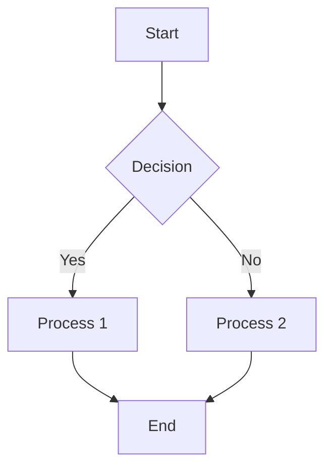

**Syntax**:
- `graph TD` - Top-down flowchart
- `graph LR` - Left-to-right flowchart
- `graph BT` - Bottom-to-top flowchart
- `graph RL` - Right-to-left flowchart

**Node shapes**:
- `A[Rectangle]` - Rectangle
- `B(Rounded)` - Rounded rectangle
- `C{Diamond}` - Diamond (decision)
- `D((Circle))` - Circle
- `E>Asymmetric]` - Asymmetric shape

### 2. Sequence Diagram

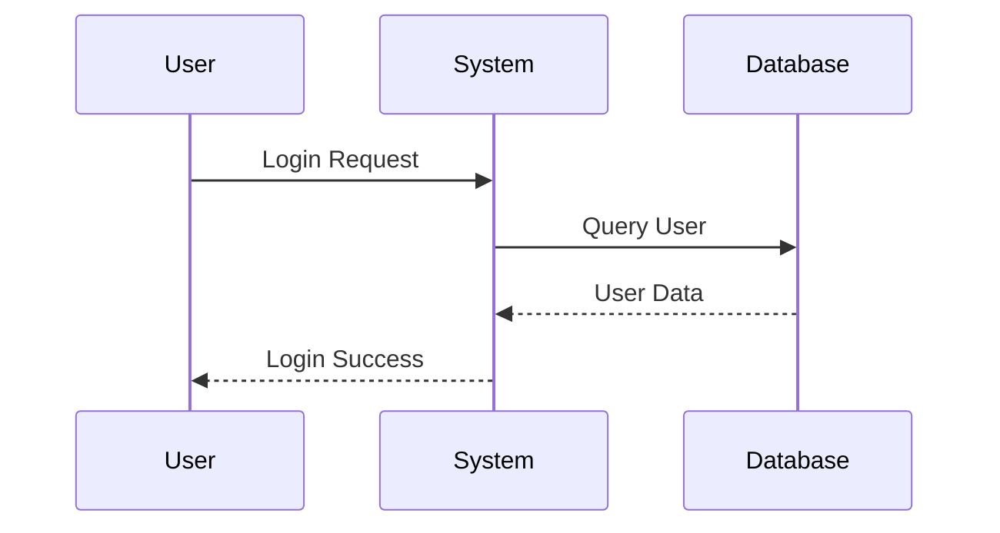

**Syntax**:
- `participant` - Define participants
- `->` - Solid line
- `-->` - Dashed line
- `->>` - Solid arrow
- `-->>` - Dashed arrow

### 3. Class Diagram

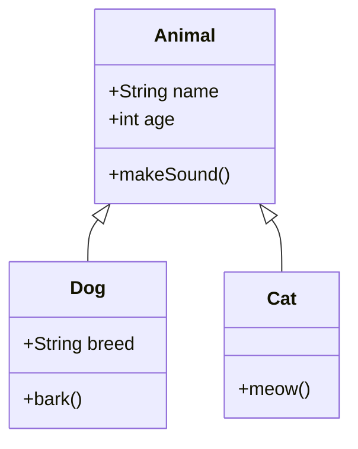

**Relationships**:
- `<|--` - Inheritance
- `*--` - Composition
- `o--` - Aggregation
- `-->` - Association
- `--` - Link (solid)
- `..>` - Dependency

### 4. State Diagram

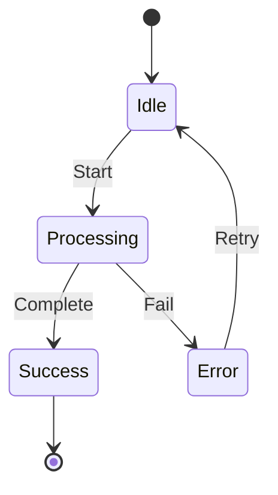

### 5. Entity Relationship Diagram (ERD)

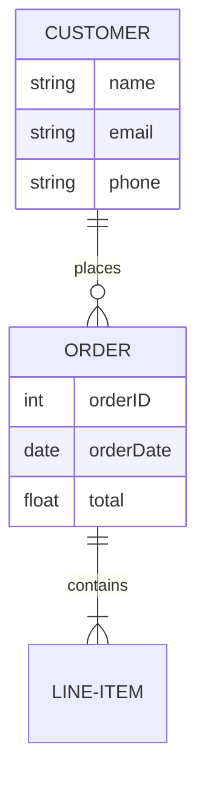

**Relationships**:
- `||--||` - One to one
- `||--o{` - One to many
- `}o--o{` - Many to many

### 6. Gantt Chart

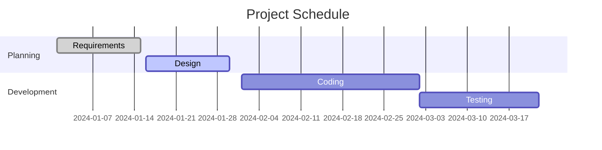

### 7. Pie Chart

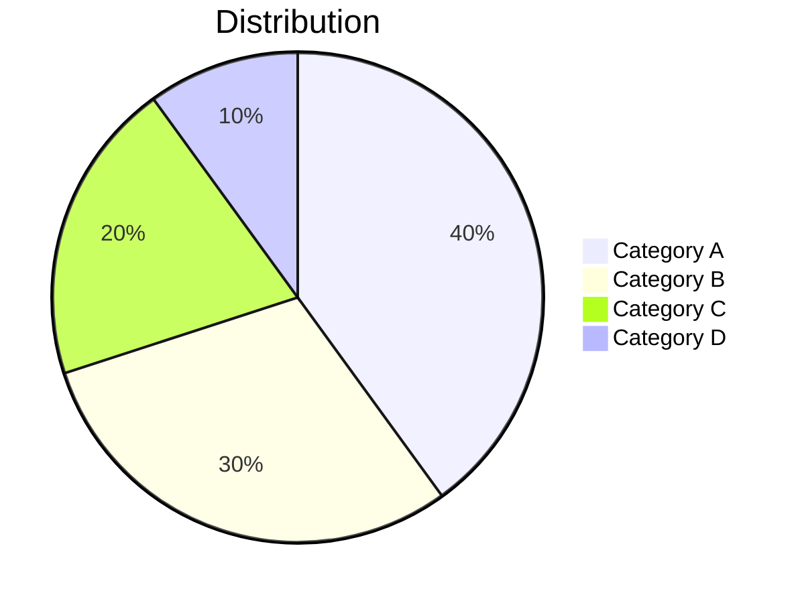

### 8. Git Graph

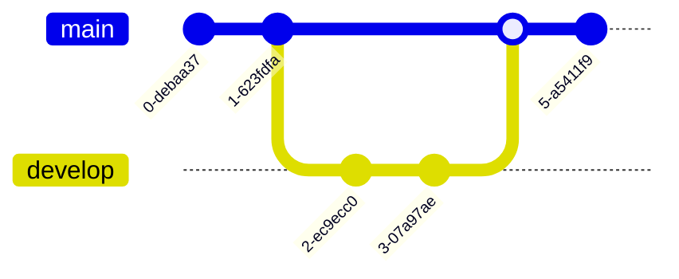

### 9. Mindmap (v10.0+)

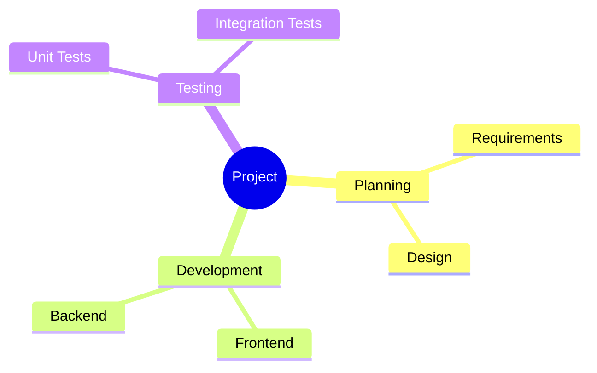

### 10. Timeline (v10.0+)

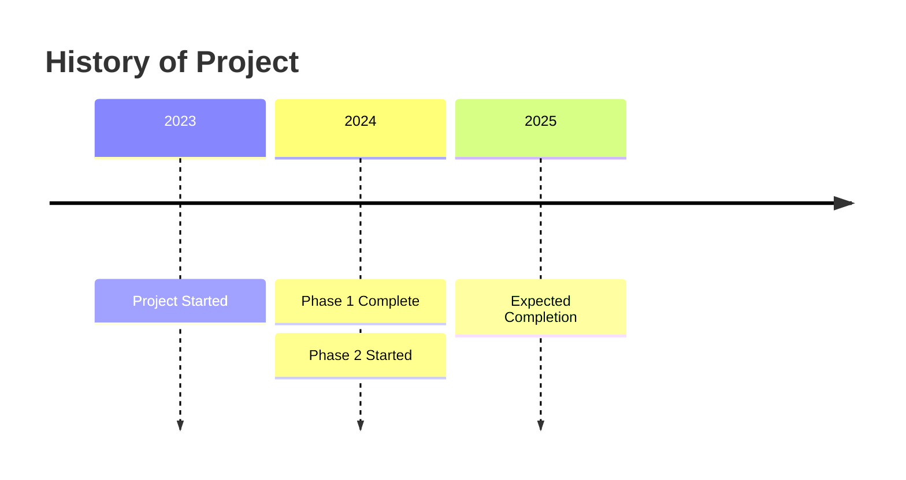

## Themes

Mermaid supports four built-in themes:

1. **default** - Standard theme with blue colors
2. **forest** - Green-based theme
3. **dark** - Dark background theme
4. **neutral** - Grayscale theme

Usage with scripts:
```bash
python mermaid_to_image.py input.mmd output.png --theme dark
python markdown_to_pdf.py input.md output.pdf --theme forest
```

## Configuration Options

### Image Format

- **PNG** - Raster format, good for web and documents
  - Pros: Wide compatibility, good quality
  - Cons: Fixed resolution, larger file size

- **SVG** - Vector format, scalable
  - Pros: Infinite scaling, smaller file size
  - Cons: Limited browser compatibility

### Background Color

Customize background color:
```bash
--background white
--background transparent
--background "#f0f0f0"
```

### Image Dimensions (PNG only)

```bash
--width 1200 --height 800
```

## Best Practices

### 1. Keep Diagrams Simple

- Limit nodes to 10-15 for readability
- Break complex diagrams into multiple smaller diagrams
- Use clear, concise labels

### 2. Use Consistent Naming

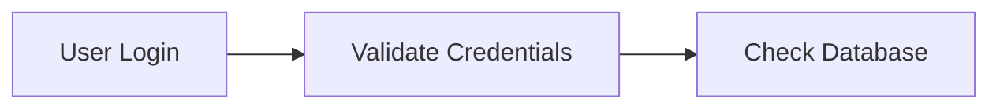

### 3. Add Comments

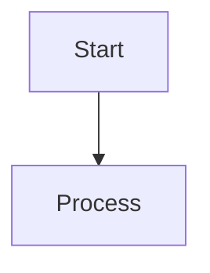

### 4. Group Related Elements

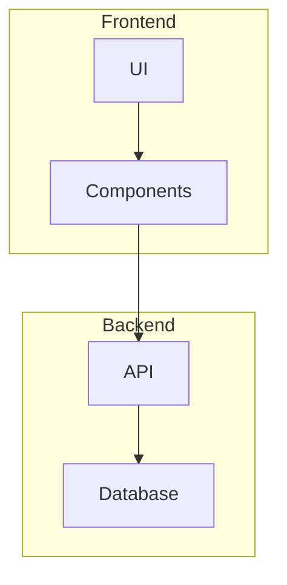

## Common Issues and Solutions

### Issue: Diagram Not Rendering

**Solutions**:
1. Check Mermaid syntax for errors
2. Ensure mermaid-cli or Playwright is installed
3. Verify code block formatting:
   ```markdown
   ```mermaid
   graph TD
       A --> B
   ```
   ```

### Issue: Text Overlapping

**Solutions**:
1. Increase image dimensions
2. Use shorter labels
3. Adjust diagram direction (TD vs LR)

### Issue: Poor Image Quality

**Solutions**:
1. Use PNG with higher resolution (--width 1600)
2. Or use SVG format for scalable quality
3. Ensure sufficient background padding

## Examples

### Example 1: System Architecture

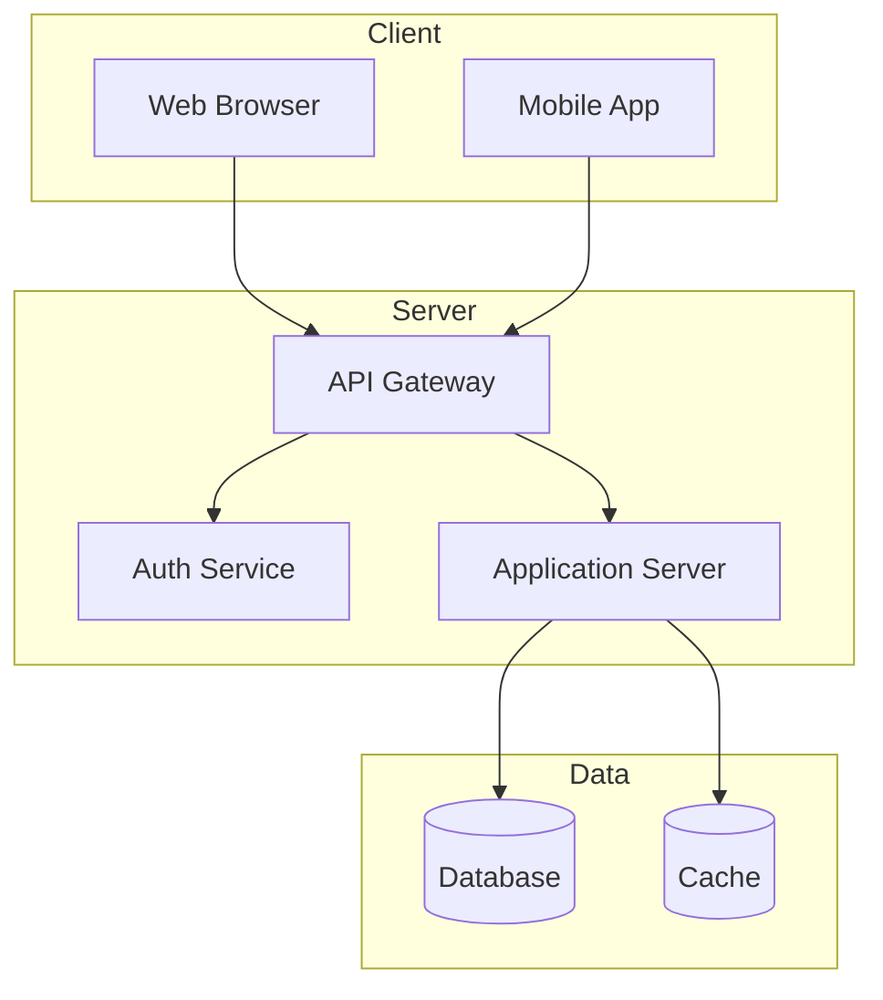

### Example 2: User Journey

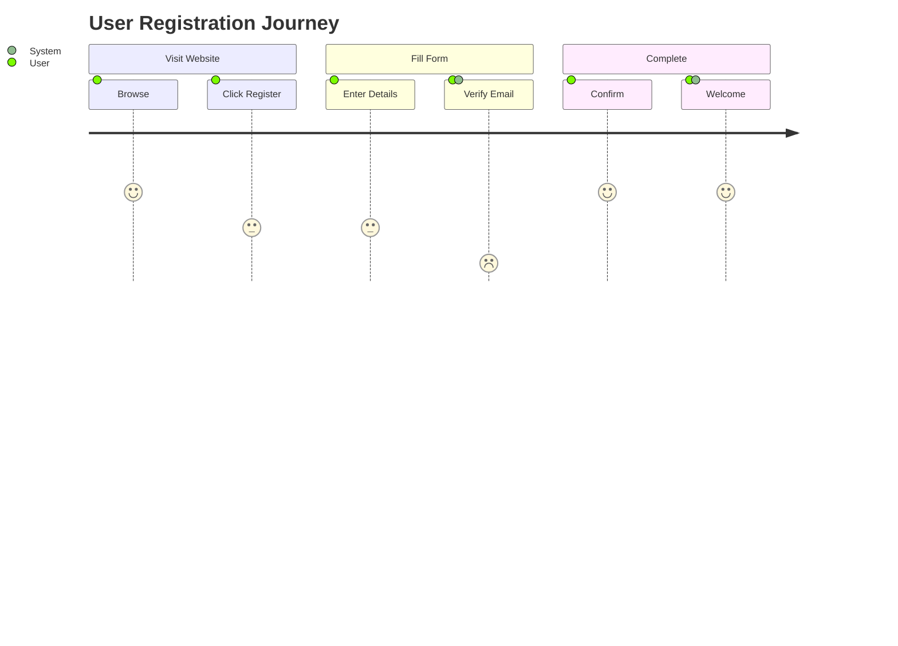

### Example 3: Database Schema

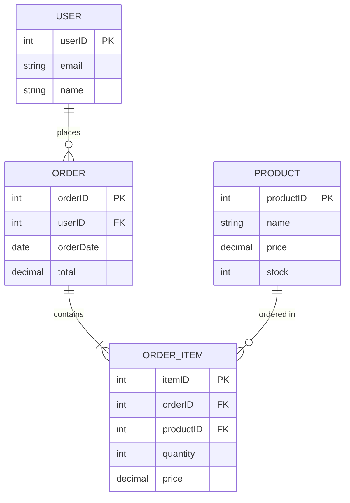

## Resources

- [Mermaid Official Documentation](https://mermaid.js.org/)
- [Mermaid Live Editor](https://mermaid.live/)
- [Mermaid GitHub Repository](https://github.com/mermaid-js/mermaid)
