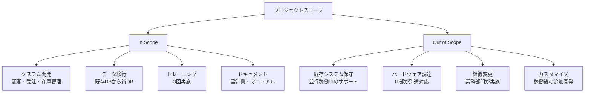
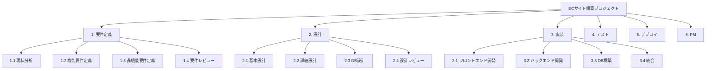
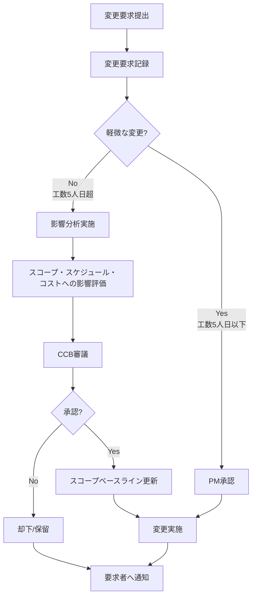
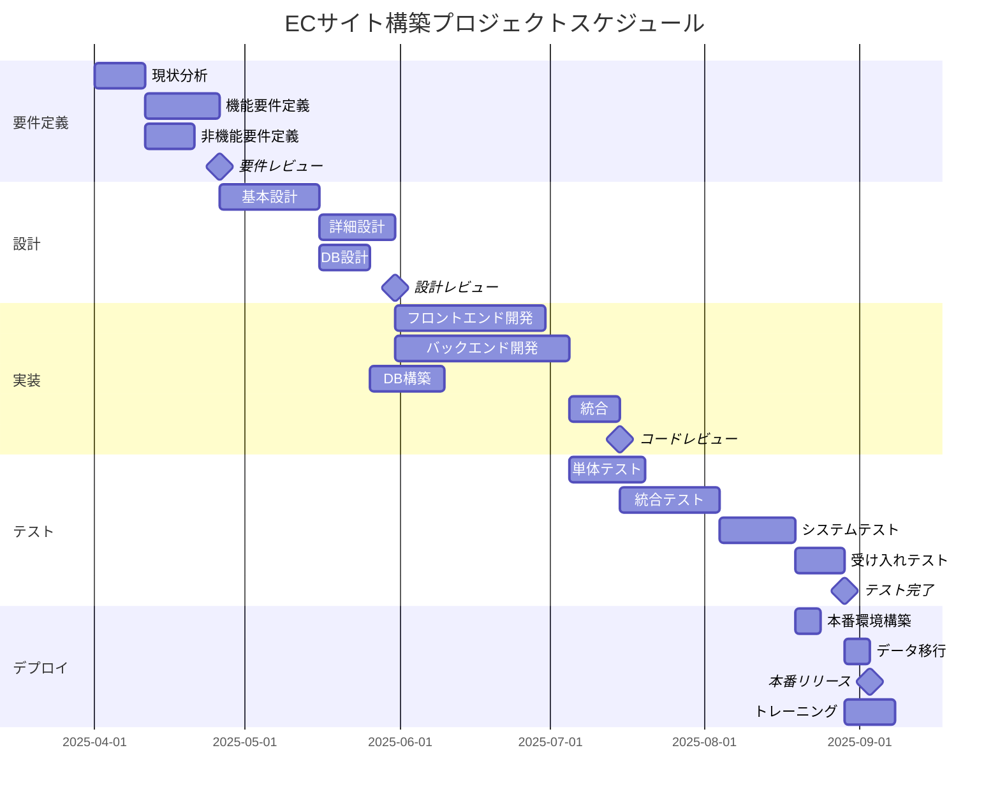
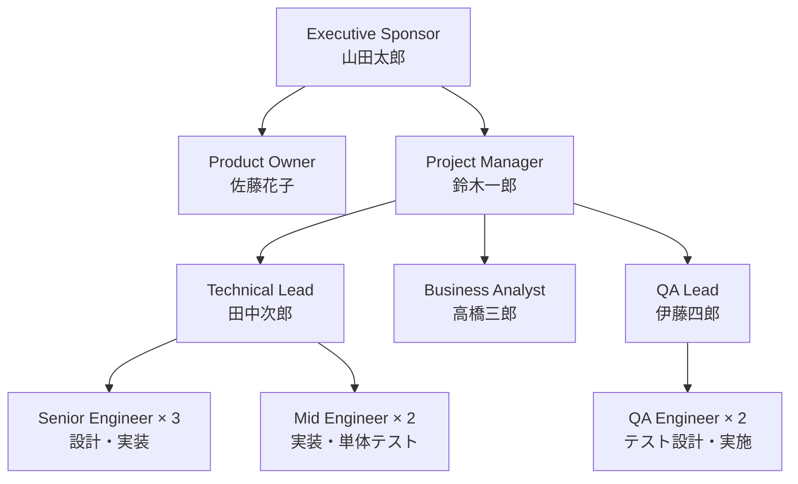
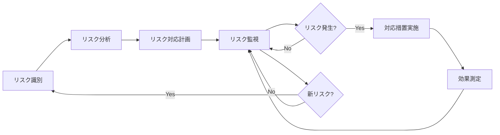
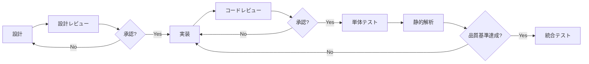

# Project Plan Creator（プロジェクト計画作成）

## Overview

This skill transforms project requirements and stakeholder needs into comprehensive, PMBOK-aligned project management artifacts. It guides you through charter creation, scope definition, WBS development, scheduling with Gantt charts, resource planning with RACI matrices, and risk management planning.

**Primary language**: Japanese (default) with English support
**Output format**: Markdown + Mermaid diagrams
**Framework alignment**: PMBOK® Guide (6th, 7th, 8th editions)

Use this skill when:
- Starting a new system development or implementation project
- You need to create a Project Charter to formally authorize the project
- You need to develop a comprehensive Project Plan with WBS, schedule, and resource allocation
- You want to visualize project structure with Mermaid diagrams (Gantt, WBS, workflows)
- You need PMBOK-compliant project documentation
- You want to integrate PM knowledge from the knowledge/pm-knowledge folder

## Core Workflows

1. **Project Charter Creation**: Create PMBOK-compliant project charters to formally authorize projects
2. **Scope Definition and Management**: Define project scope with clear boundaries and WBS
3. **Schedule Development**: Create detailed schedules with Mermaid Gantt charts
4. **Resource Planning and RACI Matrix**: Define team structure and assign responsibilities
5. **Risk Management Planning**: Identify, analyze, and plan responses for project risks
6. **Communication and Quality Planning**: Establish communication protocols and quality standards
7. **Integration and Document Generation**: Integrate all planning artifacts into cohesive project plan

---

## Workflow 1: Project Charter Creation

### Purpose
Create a formal document that authorizes the project, names the project manager, and gives authority to apply resources to project activities. The charter establishes the partnership between the performing organization and requesting organization.

### Step 1: Gather Charter Inputs

Collect information from stakeholders:
- **Business Case**: Why is this project needed? What problem does it solve?
- **Benefits Management Plan**: Expected benefits (cost reduction, revenue increase, efficiency)
- **Project Requirements**: High-level requirements from stakeholders
- **Organizational Assets**: Previous project charters, templates, lessons learned

### Step 2: Define Project Purpose and Objectives

Use `references/project_charter_guide.md` Section 3 structure:

**プロジェクトの背景**:
- 現在の課題と問題点
- なぜこのプロジェクトが必要なのか
- ビジネス上の機会

**プロジェクトの目的**:
1. **業務効率化**: 具体的な効率化指標（例: 処理時間30分→5分に短縮）
2. **品質向上**: 品質指標の改善目標（例: エラー率5%→0.5%に低減）
3. **顧客満足度向上**: サービスレベルの改善
4. **コスト削減**: 具体的な削減額と根拠
5. **売上増加**: 売上への貢献見込み

### Step 3: Define High-Level Scope

Use `references/project_charter_guide.md` Section 4:

**In Scope（含まれる内容）**:
- システム開発範囲
- データ移行範囲
- トレーニング・教育
- ドキュメント作成

**Out of Scope（含まれない内容）**:
- 既存システムの保守
- ハードウェア調達
- 組織変更・人事異動

### Step 4: Identify Key Deliverables and Milestones

**主要な成果物**:
```markdown
| 成果物 | 説明 | 納期 |
|--------|------|------|
| 要件定義書 | 機能要件・非機能要件を網羅 | M1完了時 |
| 基本設計書 | システム全体のアーキテクチャ | M2完了時 |
| 本番システム | 稼働可能なシステム | M5完了時 |
```

**プロジェクトマイルストーン**:
- M1: 要件定義完了（2025-05-15）
- M2: 基本設計完了（2025-06-30）
- M3: 実装完了（2025-09-15）
- M4: テスト完了（2025-10-30）
- M5: 本番稼働（2025-11-15）

### Step 5: Estimate Budget and Resources

**概算予算**:
```markdown
| カテゴリ | 概算金額（円） | 内訳 |
|---------|--------------|------|
| 開発費用 | 80,000,000 | 人件費（1,000人日 × 80,000円） |
| インフラ費用 | 15,000,000 | サーバー、クラウド、ライセンス |
| 間接費用 | 5,000,000 | PM、QA、予備費 |
| **合計** | **100,000,000** | 税抜 |
```

### Step 6: Identify Stakeholders and Risks

**ステークホルダー**:
```markdown
| 役割 | 氏名/部署 | 期待値・関心事 |
|------|----------|--------------|
| Executive Sponsor | 山田太郎（経営企画部長） | プロジェクト成功、ROI達成 |
| Product Owner | 佐藤花子（営業部長） | 業務効率化、使いやすさ |
| Project Manager | 鈴木一郎（IT部） | スケジュール・予算管理 |
```

**主要なリスク**:
```markdown
| リスク | 影響 | 確率 | 対策 |
|--------|------|------|------|
| 要件変更が頻発 | 高 | 中 | スコープ変更管理プロセス確立 |
| キーメンバーの離脱 | 高 | 低 | 知識移転・ドキュメント化 |
| 技術的課題 | 中 | 中 | PoC実施、技術検証期間確保 |
```

### Step 7: Define Success Criteria

Use `references/project_charter_guide.md` Section 11:

**成功基準**:
1. **スコープ**: すべての機能要件が実装され受け入れられる
2. **スケジュール**: 2025年11月15日までに本番稼働
3. **予算**: 予算100,000,000円±10%以内
4. **品質**: 重大バグゼロ、ユーザー満足度80%以上
5. **ビジネス成果**: 稼働後6ヶ月で業務効率30%改善

### Step 8: Generate Charter Document

Use `references/project_charter_guide.md` as the complete template with all 12 sections.

---

## Workflow 2: Scope Definition and Management

### Purpose
Define what is included and excluded from the project, create a detailed WBS, and establish scope change control processes.

### Step 1: Develop Scope Statement

Expand the high-level scope from the charter into detailed scope statement:

**プロジェクトスコープ記述書**:
```markdown
## 製品スコープ（Product Scope）
システムが提供する機能・特性:
- 顧客管理機能（登録、検索、編集、削除）
- 受注管理機能（見積作成、受注登録、進捗管理）
- 在庫管理機能（入出庫管理、在庫照会、棚卸）
- レポート機能（売上レポート、在庫レポート）
- ユーザー管理機能（認証、権限管理）

## プロジェクトスコープ（Project Scope）
プロジェクトで実施する作業:
- 要件定義、設計、実装、テスト
- データ移行（既存システムからのデータ移行）
- ユーザートレーニング（3回、各2時間）
- ドキュメント作成（設計書、運用マニュアル、ユーザーガイド）
```

### Step 2: Create Scope Boundaries Visualization

Use Mermaid to visualize scope boundaries:



### Step 3: Develop Work Breakdown Structure (WBS)

Create hierarchical decomposition of project work. Use `assets/project_plan_template.md` Section 4 as reference.

**WBS Example with Mermaid**:


**Detailed WBS Table**:
```markdown
| WBS ID | タスク名 | 成果物 | 担当 | 期間 |
|--------|---------|--------|------|------|
| 1 | 要件定義 | 要件定義書 | BA | 20日 |
| 1.1 | 現状分析 | 現状分析レポート | BA | 5日 |
| 1.2 | 機能要件定義 | 機能要件一覧 | BA/PO | 10日 |
| 1.3 | 非機能要件定義 | 非機能要件書 | BA/Arch | 5日 |
| 2 | 設計 | 設計書 | Arch/Tech Lead | 30日 |
| 2.1 | 基本設計 | 基本設計書 | Arch | 15日 |
| 2.2 | 詳細設計 | 詳細設計書 | Tech Lead | 10日 |
| 2.3 | DB設計 | DB設計書 | DBA | 5日 |
```

### Step 4: Establish Scope Baseline

Document the approved scope baseline consisting of:
1. **Project Scope Statement**: Detailed description of project and product scope
2. **WBS**: Visual and tabular representation
3. **WBS Dictionary**: Detailed descriptions of WBS components

### Step 5: Define Scope Change Control Process

**変更管理プロセス**:


---

## Workflow 3: Schedule Development with Gantt Charts

### Purpose
Create a detailed project schedule with task dependencies, resource assignments, and critical path visualization using Mermaid Gantt charts.

### Step 1: Define Activities

For each WBS work package, define specific activities:
- Activity ID
- Activity name
- Duration estimate (using PERT: (Optimistic + 4×Most Likely + Pessimistic) / 6)
- Resource requirements
- Constraints

### Step 2: Sequence Activities

Identify dependencies using:
- **FS (Finish-to-Start)**: Task B starts after Task A finishes (most common)
- **SS (Start-to-Start)**: Task B starts when Task A starts
- **FF (Finish-to-Finish)**: Task B finishes when Task A finishes
- **SF (Start-to-Finish)**: Task B finishes when Task A starts (rare)

### Step 3: Estimate Activity Durations

Use three-point estimation:
```markdown
例: フロントエンド開発
- 楽観値（Optimistic）: 15日
- 最頻値（Most Likely）: 20日
- 悲観値（Pessimistic）: 30日

PERT推定値 = (15 + 4×20 + 30) / 6 = 20.83日 ≈ 21日
```

### Step 4: Create Gantt Chart with Mermaid

Use `assets/project_plan_template.md` Section 5 structure:



### Step 5: Identify Critical Path

Analyze the Gantt chart to identify critical path:
- 要件定義 → 設計 → 実装（バックエンド開発） → 統合 → 統合テスト → システムテスト → 受け入れテスト → デプロイ

Mark critical path activities and focus management attention on these.

### Step 6: Optimize Schedule

Apply schedule compression techniques if needed:
- **Crashing**: Add resources to critical path activities
- **Fast Tracking**: Overlap activities that were previously sequential (increases risk)

---

## Workflow 4: Resource Planning and RACI Matrix

### Purpose
Define project team structure, assign roles and responsibilities, and create RACI matrix to clarify accountability.

### Step 1: Define Project Roles

**プロジェクト体制**:
```markdown
| 役割 | 氏名 | 責任範囲 | 稼働率 |
|------|------|---------|--------|
| Executive Sponsor | 山田太郎 | 意思決定、予算承認 | 5% |
| Product Owner | 佐藤花子 | 要件定義、優先順位決定 | 50% |
| Project Manager | 鈴木一郎 | 全体管理、進捗管理 | 100% |
| Technical Lead | 田中次郎 | 技術アーキテクチャ、技術的意思決定 | 80% |
| Business Analyst | 高橋三郎 | 要件分析、業務フロー設計 | 100% |
| Senior Engineer × 3 | [氏名] | 設計、実装、コードレビュー | 100% |
| QA Engineer × 2 | [氏名] | テスト計画、テスト実施 | 100% |
```

### Step 2: Create RACI Matrix

Use `assets/project_plan_template.md` Section 7 structure:

**RACI Matrix**:
```markdown
| タスク/成果物 | Sponsor | PO | PM | Tech Lead | BA | SE | QA |
|-------------|---------|----|----|-----------|----|----|-----|
| プロジェクト計画 | A | C | R | C | C | I | I |
| 要件定義 | I | A | C | C | R | I | I |
| 基本設計 | I | C | A | R | C | I | I |
| 詳細設計 | I | I | A | R | I | C | C |
| 実装 | I | I | A | R | I | R | I |
| 単体テスト | I | I | A | C | I | R | C |
| 統合テスト | I | C | A | C | I | C | R |
| 受け入れテスト | I | A | R | I | C | I | R |
| 本番リリース | A | C | R | R | I | C | C |

凡例:
R (Responsible) = 実行責任者
A (Accountable) = 説明責任者（最終意思決定者）
C (Consulted) = 相談先（事前に意見を聞く）
I (Informed) = 報告先（結果を報告）
```

### Step 3: Define Communication Protocols

**コミュニケーション計画**:
```markdown
| 活動 | 頻度 | 参加者 | 目的 | 形式 |
|------|------|--------|------|------|
| キックオフミーティング | 初回のみ | 全員 | プロジェクト開始、目標共有 | 対面 |
| 週次進捗会議 | 毎週月曜 | PM, TL, BA | 進捗確認、課題共有 | オンライン |
| ステアリングコミッティ | 月1回 | Sponsor, PO, PM | 意思決定、方向性確認 | 対面 |
| デイリースタンドアップ | 毎朝 | 開発チーム | 日次進捗、障害共有 | オンライン |
| ステータスレポート | 毎週金曜 | 全ステークホルダー | 進捗・課題・リスク報告 | メール |
```

### Step 4: Visualize Team Structure



---

## Workflow 5: Risk Management Planning

### Purpose
Identify potential risks, analyze their impact and probability, plan response strategies, and establish monitoring processes.

### Step 1: Identify Risks

Use brainstorming, checklists, and historical data. Categorize risks:

**技術リスク**:
- 新技術の習得に時間がかかる
- 性能要件を満たせない
- 外部APIの仕様変更

**スコープ/要件リスク**:
- 要件変更が頻発する
- ステークホルダー間で要件の認識が異なる
- スコープクリープ（範囲の拡大）

**リソースリスク**:
- キーメンバーの離脱
- スキル不足
- リソース競合（他プロジェクトとの兼務）

**統合リスク**:
- 既存システムとの連携が困難
- データ移行の複雑さ
- 第三者システムとの互換性問題

**外部リスク**:
- ベンダーの納期遅延
- 法規制の変更
- 市場環境の変化

### Step 2: Analyze Risks (Qualitative)

For each identified risk, assess:
- **確率（Probability）**: 高/中/低
- **影響（Impact）**: 高/中/低
- **リスクレベル**: 確率 × 影響

**リスク登録簿**:
```markdown
| ID | リスク | カテゴリ | 確率 | 影響 | レベル | トリガー |
|----|--------|---------|------|------|--------|---------|
| R-01 | 要件変更が頻発 | 要件 | 高 | 高 | 高 | ステークホルダーからの追加要望 |
| R-02 | キーメンバー離脱 | リソース | 低 | 高 | 中 | メンバーの退職意向 |
| R-03 | 性能要件未達 | 技術 | 中 | 高 | 高 | 負荷テストで性能不足判明 |
| R-04 | データ移行失敗 | 統合 | 中 | 高 | 高 | データ整合性エラー |
| R-05 | 外部API変更 | 外部 | 低 | 中 | 低 | ベンダーからの変更通知 |
```

### Step 3: Plan Risk Responses

For each high/medium risk, plan response strategy:

**対応戦略**:
- **回避（Avoid）**: リスクを完全に排除する
- **軽減（Mitigate）**: リスクの確率または影響を減らす
- **転嫁（Transfer）**: リスクを第三者に移す（保険、外注等）
- **受容（Accept）**: リスクを認識し、発生時に対処

**リスク対応計画**:
```markdown
| ID | リスク | 対応戦略 | 対応策 | 担当 | コスト |
|----|--------|---------|--------|------|--------|
| R-01 | 要件変更頻発 | 軽減 | 変更管理プロセス確立、スコープベースライン承認 | PM | 0円 |
| R-02 | キーメンバー離脱 | 軽減 | ドキュメント化、ペアプログラミング、知識共有 | PM/TL | 予算の5% |
| R-03 | 性能要件未達 | 軽減 | 早期PoC実施、アーキテクチャレビュー | TL | 予算の3% |
| R-04 | データ移行失敗 | 軽減 | 移行リハーサル実施、ロールバック計画 | DBA | 予算の2% |
| R-05 | 外部API変更 | 受容 | アダプターパターンで疎結合化、予備費確保 | TL | 予算の1% |
```

### Step 4: Establish Risk Monitoring Process

Use `assets/project_plan_template.md` Section 8 Mermaid diagram:



**リスクレビュー頻度**:
- 高リスク: 毎週レビュー
- 中リスク: 隔週レビュー
- 低リスク: 月次レビュー

---

## Workflow 6: Communication and Quality Planning

### Purpose
Establish communication protocols, reporting structures, and quality assurance processes to ensure stakeholder alignment and deliverable quality.

### Step 1: Define Stakeholder Communication Needs

Analyze each stakeholder group:
- 必要な情報
- 受け取りたい頻度
- 好みの形式（対面/メール/レポート）
- 報告内容の詳細度

### Step 2: Create Communication Matrix

Use `assets/project_plan_template.md` Section 9:

```markdown
| 情報 | 発信者 | 受信者 | 頻度 | 方法 | 目的 |
|------|--------|--------|------|------|------|
| ステータスレポート | PM | Sponsor, PO, 全員 | 週次 | メール | 進捗・課題・リスク報告 |
| 進捗会議議事録 | PM | 参加者全員 | 週次 | Confluence | 決定事項・アクション記録 |
| リスク登録簿 | PM | Sponsor, PO, TL | 週次 | Excel/Jira | リスク状況共有 |
| 変更要求ログ | PM | CCB | 随時 | 変更管理システム | 変更要求追跡 |
| テストレポート | QA Lead | PM, PO, TL | フェーズ毎 | PDF | 品質状況報告 |
```

### Step 3: Define Quality Standards

**品質基準**:
```markdown
## コード品質
- コードカバレッジ: 80%以上
- 複雑度（Cyclomatic Complexity）: 10以下
- コードレビュー: 全コードを2名以上でレビュー
- 静的解析: SonarQubeでバグ・脆弱性ゼロ

## テスト品質
- 単体テストカバレッジ: 80%以上
- 統合テスト: 全APIエンドポイントをテスト
- システムテスト: 全機能要件をテスト
- 受け入れテスト: ビジネスシナリオ100%実施

## ドキュメント品質
- すべての設計書をレビュー・承認
- API仕様書の自動生成（Swagger/OpenAPI）
- 運用マニュアルのユーザーレビュー実施
```

### Step 4: Establish Quality Assurance Process



### Step 5: Define Acceptance Criteria

**受け入れ基準**:
```markdown
| 成果物 | 受け入れ基準 | 検証方法 | 承認者 |
|--------|------------|---------|--------|
| 要件定義書 | すべての要件が記載され、POが承認 | レビュー会議 | PO |
| 基本設計書 | アーキテクチャが明確、非機能要件を満たす設計 | 設計レビュー | Tech Lead |
| ソースコード | カバレッジ80%以上、レビュー承認済み | 自動テスト、レビュー | Tech Lead |
| テストレポート | 全テストケース実施、重大バグゼロ | テスト結果確認 | QA Lead |
| 本番システム | 受け入れテスト合格、性能要件達成 | UAT、性能テスト | PO |
```

---

## Workflow 7: Integration and Document Generation

### Purpose
Integrate all planning artifacts into a cohesive, comprehensive project plan document using the template.

### Step 1: Load Project Plan Template

Use `assets/project_plan_template.md` as the base template with 12 sections:

1. プロジェクト基本情報
2. エグゼクティブサマリー
3. プロジェクトスコープ
4. WBS（作業分解構成図）
5. プロジェクトスケジュール（Gantt Chart）
6. 成果物一覧
7. チーム体制とRACI
8. リスク管理計画
9. コミュニケーション計画
10. 品質管理計画
11. 変更管理計画
12. 承認

### Step 2: Populate Each Section

**Section 1 - プロジェクト基本情報**:
From Project Charter, fill in:
- プロジェクト名
- プロジェクトコード
- プロジェクトマネージャー
- 開始日・終了日
- 総予算

**Section 3 - Scope with Mermaid**:
Use the scope boundary diagram created in Workflow 2

**Section 4 - WBS with Mermaid**:
Use the WBS hierarchy diagram from Workflow 2

**Section 5 - Gantt Chart**:
Use the Mermaid Gantt chart from Workflow 3

**Section 7 - RACI Matrix**:
Use the RACI matrix from Workflow 4

**Section 8 - Risk Management**:
Use the risk register and monitoring process from Workflow 5

**Section 9 - Communication Plan**:
Use the communication matrix from Workflow 6

**Section 10 - Quality Plan**:
Use the quality standards and QA process from Workflow 6

### Step 3: Add Project-Specific Content

Customize the template with project-specific:
- Business objectives and expected benefits
- Technology stack and architecture decisions
- Integration points with existing systems
- Data migration strategy
- Training and change management approach
- Post-implementation support plan

### Step 4: Generate Mermaid Diagrams

Ensure all Mermaid diagrams render correctly:
- Scope boundary diagram
- WBS hierarchy
- Gantt chart
- Risk monitoring process
- Quality assurance workflow
- Change management process

### Step 5: Quality Check and Validation

**Checklist**:
- [ ] すべてのセクションが記入されている
- [ ] Mermaidダイアグラムが正しく表示される
- [ ] RACI matrixに抜け漏れがない（すべてのタスクに1名のAがいる）
- [ ] Ganttチャートのマイルストーンが明確
- [ ] リスクに対応策が定義されている
- [ ] 成果物の受け入れ基準が明確
- [ ] 変更管理プロセスが定義されている

### Step 6: Stakeholder Review and Approval

Submit the project plan for review:
1. Technical Lead review (技術的妥当性)
2. Product Owner review (ビジネス価値、スコープ)
3. Sponsor review (予算、リソース、ROI)
4. Team review (実現可能性、工数)

Incorporate feedback and obtain formal approval.

### Step 7: Baseline and Version Control

Once approved:
- Save as **Project Plan Baseline v1.0**
- Store in version control (Git) or document management system
- Any changes must go through change control process
- Maintain version history

---

## Leveraging PM Knowledge

This skill integrates with the `knowledge/pm-knowledge` folder for PMBOK standards and best practices.

**When to reference PM knowledge**:
- Uncertain about PMBOK terminology or processes
- Need industry-standard templates or checklists
- Want to validate approach against PMI standards
- Need guidance on specific knowledge areas (Schedule Management, Risk Management, etc.)

**Knowledge areas available**:
- Project Integration Management
- Project Scope Management
- Project Schedule Management
- Project Cost Management
- Project Quality Management
- Project Resource Management
- Project Communications Management
- Project Risk Management
- Project Procurement Management
- Project Stakeholder Management

**Usage pattern**:
```markdown
When creating WBS, consult knowledge/pm-knowledge for:
- WBS best practices
- Work package sizing guidelines
- WBS decomposition techniques
- WBS dictionary templates
```

---

## Resources

### references/

**`project_charter_guide.md`**: Comprehensive guide for creating PMBOK-compliant project charters
- 12 sections covering all charter components
- Examples for system development projects
- Best practices and common pitfalls
- PMBOK alignment notes

### assets/

**`project_plan_template.md`**: Complete project plan template with Mermaid diagrams
- 12 main sections (400+ lines)
- 5 Mermaid diagrams (Scope, WBS, Gantt, Risk Process, Change Management)
- RACI matrix template
- Comprehensive tables for deliverables, risks, communication
- Ready to customize for any project

---

## Best Practices

1. **Start with Charter**: Always create Project Charter first to formally authorize project
2. **Use Visual Diagrams**: Leverage Mermaid for WBS, Gantt, and process flows
3. **Define RACI Early**: Clarify roles and responsibilities to avoid confusion
4. **Proactive Risk Management**: Identify risks early and monitor continuously
5. **Baseline Everything**: Establish scope, schedule, and cost baselines before execution
6. **Version Control**: Maintain document versions and change history
7. **Stakeholder Engagement**: Regular communication and expectation management
8. **PMBOK Alignment**: Follow PMBOK processes for consistency and professionalism

---

## Common Pitfalls

1. ❌ Skipping Project Charter creation
2. ❌ Vague scope definition leading to scope creep
3. ❌ Unrealistic schedule without buffer time
4. ❌ Missing RACI matrix causing role confusion
5. ❌ Ignoring risk management until problems occur
6. ❌ Lack of change control process
7. ❌ Insufficient stakeholder communication
8. ❌ Not establishing quality standards upfront

---

## Quick Reference

### プロジェクト計画作成の8ステップ

1. [ ] プロジェクトチャーターを作成して承認を得る
2. [ ] スコープを定義し、In/Out of Scopeを明確化
3. [ ] WBSを作成（フェーズ→成果物→タスク）
4. [ ] スケジュールを作成（Ganttチャート、マイルストーン）
5. [ ] RACI matrixで役割と責任を明確化
6. [ ] リスクを識別し、対応策を計画
7. [ ] コミュニケーション計画と品質基準を設定
8. [ ] 統合してプロジェクト計画書を作成、承認取得

### Mermaid Diagram Types Used

- **Gantt Chart**: `gantt` - プロジェクトスケジュール
- **Graph/Flowchart**: `graph TD/LR` - WBS、プロセスフロー、スコープ境界
- **Organization Chart**: `graph TD` - チーム体制図

---

このスキルの目的は、PMBOK準拠の包括的なプロジェクト計画を作成し、プロジェクト成功の基盤を構築することです。
