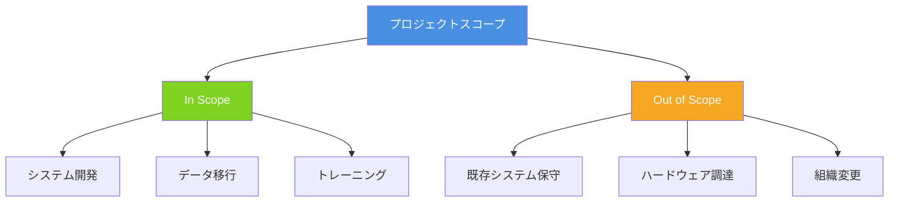
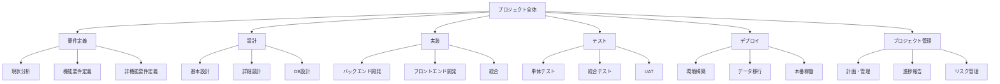
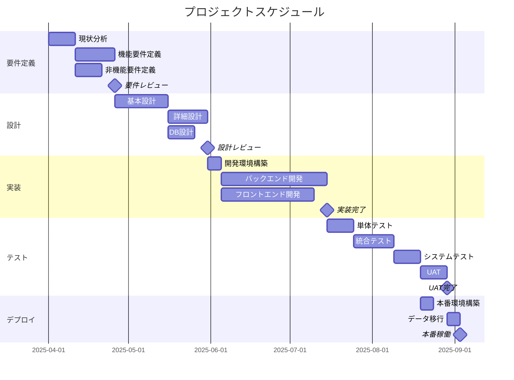
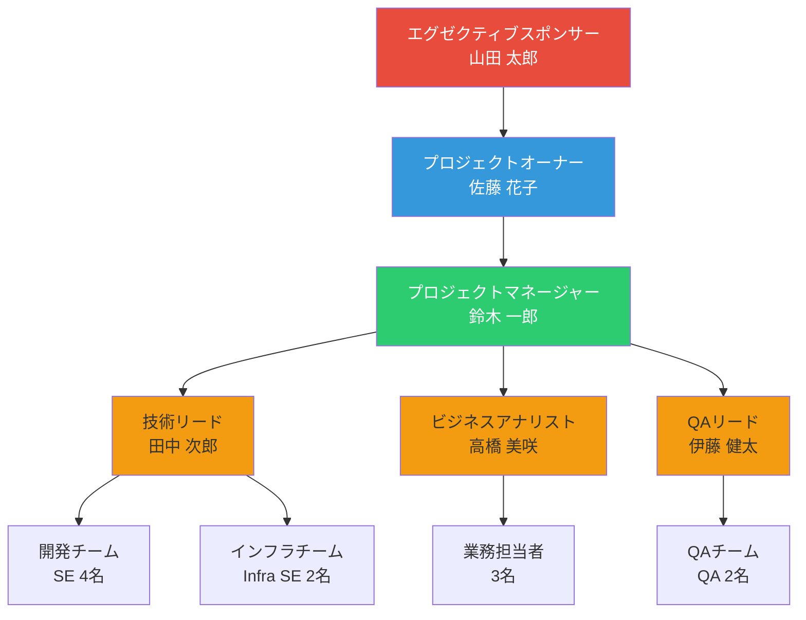
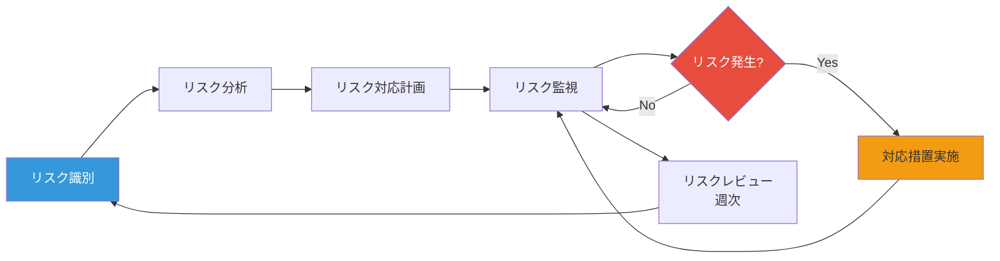
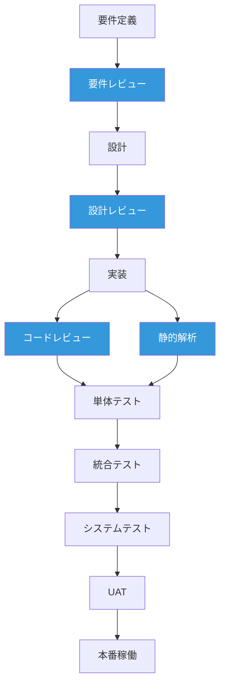
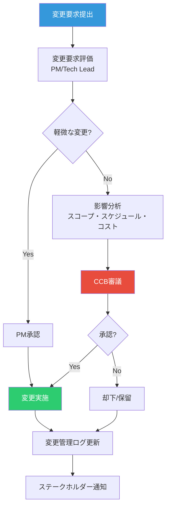

# プロジェクト計画書
# Project Plan

**プロジェクト名**: [プロジェクト名]
**Project Name**: [Project Name]

**プロジェクトコード**: [PRJ-YYYY-XXX]
**発行日**: [YYYY年MM月DD日]
**バージョン**: [1.0]
**作成者**: [プロジェクトマネージャー名]

---

## 目次 / Table of Contents

1. [エグゼクティブサマリー](#1-エグゼクティブサマリー)
2. [プロジェクト憲章](#2-プロジェクト憲章)
3. [プロジェクトスコープ](#3-プロジェクトスコープ)
4. [WBS（作業分解構造）](#4-wbs作業分解構造)
5. [プロジェクトスケジュール（Gantt Chart）](#5-プロジェクトスケジュールgantt-chart)
6. [成果物一覧](#6-成果物一覧)
7. [組織体制とRACIマトリックス](#7-組織体制とraciマトリックス)
8. [リスク管理計画](#8-リスク管理計画)
9. [コミュニケーション計画](#9-コミュニケーション計画)
10. [品質管理計画](#10-品質管理計画)
11. [変更管理計画](#11-変更管理計画)
12. [承認](#12-承認)

---

## 1. エグゼクティブサマリー

### 1.1 プロジェクト概要

[プロジェクトの背景、目的、期待される成果を1-2段落で要約]

**例**:
```
当社の[既存システム名]は[XX]年前に開発され、現在のビジネスニーズに対応できていません。
本プロジェクトは[システム名]を刷新し、[主要な改善点]を実現します。
これにより、[定量的な効果]を見込みます。
```

### 1.2 プロジェクトの価値提案

| 項目 | 内容 |
|------|------|
| **投資額** | [XX,XXX,XXX]円 |
| **年間便益** | [XX,XXX,XXX]円 |
| **投資回収期間** | [X.X]年 |
| **ROI（5年間）** | [XXX]% |
| **主要KPI** | [KPI1]: [目標値]<br>[KPI2]: [目標値] |

### 1.3 プロジェクト期間

- **開始日**: [YYYY年MM月DD日]
- **完了予定日**: [YYYY年MM月DD日]
- **期間**: [XX]ヶ月

---

## 2. プロジェクト憲章

### 2.1 プロジェクト目的

1. **[目的1]**: [説明]
2. **[目的2]**: [説明]
3. **[目的3]**: [説明]

### 2.2 成功基準

#### スケジュール達成
- [YYYY年MM月DD日]までに本番稼働完了

#### 予算遵守
- 総予算[XX,XXX,XXX]円以内でプロジェクト完了

#### 品質基準
- システムテストパス率[XX]%以上
- UAT合格
- 本番稼働後[XX]ヶ月間の重大障害ゼロ

#### ビジネス目標達成
- [KPI1]: [現状値] → [目標値]
- [KPI2]: [現状値] → [目標値]

### 2.3 主要ステークホルダー

| 役割 | 氏名 | 組織 | 責任 |
|------|------|------|------|
| エグゼクティブスポンサー | [氏名] | [組織] | プロジェクト承認、予算確保 |
| プロジェクトオーナー | [氏名] | [組織] | ビジネス要件定義、UAT |
| プロジェクトマネージャー | [氏名] | [組織] | プロジェクト全体管理 |
| 技術リード | [氏名] | [組織] | 技術アーキテクチャ、品質 |

---

## 3. プロジェクトスコープ

### 3.1 スコープ記述書

[プロジェクトで実現する内容を詳細に記述]

### 3.2 In Scope（スコープ内）

**システム開発**:
- [機能1]
- [機能2]
- [機能3]

**主要機能**:
- [機能A]: [説明]
- [機能B]: [説明]
- [機能C]: [説明]

**データ移行**:
- [移行範囲]

### 3.3 Out of Scope（スコープ外）

- [対象外項目1]
- [対象外項目2]
- [対象外項目3]

### 3.4 スコープ境界



---

## 4. WBS（作業分解構造）

### 4.1 WBS階層図



### 4.2 WBS詳細

| WBS ID | タスク名 | 説明 | 工数 | 担当 |
|--------|---------|------|------|------|
| 1.0 | 要件定義 | | [XXX]人日 | BA |
| 1.1 | 現状分析 | As-Is業務フロー分析 | [XX]人日 | BA |
| 1.2 | 機能要件定義 | 機能仕様書作成 | [XX]人日 | BA |
| 1.3 | 非機能要件定義 | 性能・セキュリティ要件 | [XX]人日 | Architect |
| 2.0 | 設計 | | [XXX]人日 | Architect/SE |
| 2.1 | 基本設計 | システムアーキテクチャ | [XX]人日 | Architect |
| 2.2 | 詳細設計 | クラス設計、API設計 | [XX]人日 | SE |
| 2.3 | DB設計 | データモデル、テーブル設計 | [XX]人日 | DBA |
| 3.0 | 実装 | | [XXX]人日 | SE |
| 3.1 | バックエンド開発 | API実装 | [XX]人日 | SE |
| 3.2 | フロントエンド開発 | 画面実装 | [XX]人日 | FE SE |
| 3.3 | 統合 | システム統合 | [XX]人日 | SE |
| 4.0 | テスト | | [XXX]人日 | QA |
| 4.1 | 単体テスト | ユニットテスト | [XX]人日 | SE |
| 4.2 | 統合テスト | 結合テスト | [XX]人日 | QA |
| 4.3 | UAT | ユーザー受入テスト | [XX]人日 | User/QA |
| 5.0 | デプロイ | | [XXX]人日 | DevOps |
| 5.1 | 環境構築 | 本番環境セットアップ | [XX]人日 | Infra SE |
| 5.2 | データ移行 | 既存データ移行 | [XX]人日 | DBA |
| 5.3 | 本番稼働 | Go-Live | [XX]人日 | All |
| 6.0 | プロジェクト管理 | | [XXX]人日 | PM |
| 6.1 | 計画・管理 | プロジェクト計画、WBS | [XX]人日 | PM |
| 6.2 | 進捗報告 | 週次・月次報告 | [XX]人日 | PM |
| 6.3 | リスク管理 | リスク識別・対応 | [XX]人日 | PM |

---

## 5. プロジェクトスケジュール（Gantt Chart）

### 5.1 マイルストーン

| マイルストーン | 完了予定日 | 説明 |
|--------------|-----------|------|
| プロジェクト開始 | [YYYY/MM/DD] | キックオフ会議 |
| 要件定義完了 | [YYYY/MM/DD] | 要件承認 |
| 基本設計完了 | [YYYY/MM/DD] | 設計承認 |
| 詳細設計完了 | [YYYY/MM/DD] | 詳細設計レビュー完了 |
| 実装完了 | [YYYY/MM/DD] | コーディング完了 |
| 統合テスト完了 | [YYYY/MM/DD] | IT完了 |
| UAT完了 | [YYYY/MM/DD] | UAT合格 |
| 本番稼働 | [YYYY/MM/DD] | Go-Live |

### 5.2 Gantt Chart（Mermaid）



---

## 6. 成果物一覧

### 6.1 成果物マトリックス

| カテゴリ | 成果物名 | 責任者 | レビュー者 | 承認者 | 完了予定日 |
|---------|---------|--------|-----------|--------|-----------|
| **要件定義** | 要件定義書 | BA | PM, Tech Lead | PO | [YYYY/MM/DD] |
| | 機能仕様書 | BA | PM | PO | [YYYY/MM/DD] |
| | 非機能要件書 | Architect | PM | PO | [YYYY/MM/DD] |
| **設計** | 基本設計書 | Architect | PM, Tech Lead | PO | [YYYY/MM/DD] |
| | 詳細設計書 | SE | Tech Lead | PM | [YYYY/MM/DD] |
| | DB設計書 | DBA | Architect | PM | [YYYY/MM/DD] |
| **実装** | ソースコード | SE | Tech Lead | PM | [YYYY/MM/DD] |
| | 単体テストコード | SE | Tech Lead | PM | [YYYY/MM/DD] |
| **テスト** | テスト計画書 | QA | PM | PO | [YYYY/MM/DD] |
| | テスト仕様書 | QA | Tech Lead | PM | [YYYY/MM/DD] |
| | テスト結果報告書 | QA | PM | PO | [YYYY/MM/DD] |
| **運用** | 運用マニュアル | SE/Infra SE | PM | PO | [YYYY/MM/DD] |
| | 障害対応手順書 | SE | PM | PO | [YYYY/MM/DD] |

### 6.2 成果物の品質基準

| 成果物 | 品質基準 | 検証方法 |
|--------|---------|---------|
| 要件定義書 | 要件の完全性・明確性・検証可能性 | レビュー、ステークホルダー承認 |
| 設計書 | 設計の一貫性・実現可能性 | アーキテクチャレビュー |
| ソースコード | コーディング規約遵守、カバレッジ80%以上 | コードレビュー、静的解析 |
| テスト仕様書 | テストカバレッジ95%以上 | レビュー |

---

## 7. 組織体制とRACIマトリックス

### 7.1 プロジェクト組織図



### 7.2 RACIマトリックス

**凡例**:
- **R** (Responsible): 実行責任者
- **A** (Accountable): 説明責任者（最終責任者）
- **C** (Consulted): 相談先
- **I** (Informed): 報告先

| タスク/成果物 | Executive Sponsor | PO | PM | Tech Lead | BA | SE | QA | Infra SE | User |
|-------------|------------------|----|----|-----------|----|----|----|---------|----|
| **プロジェクト計画** | A | C | R | C | C | I | I | I | I |
| **要件定義** | I | A | C | C | R | I | I | I | C |
| **基本設計** | I | C | A | R | C | I | I | C | I |
| **詳細設計** | I | I | A | R | I | R | I | C | I |
| **実装** | I | I | A | R | I | R | I | C | I |
| **単体テスト** | I | I | C | R | I | R | C | I | I |
| **統合テスト** | I | I | A | C | I | C | R | C | I |
| **UAT** | I | A | C | C | C | C | R | I | R |
| **本番稼働判断** | A | R | C | C | I | I | C | C | I |
| **変更管理** | C | A | R | C | C | I | I | I | I |
| **リスク管理** | C | C | R | C | C | I | I | I | I |
| **進捗報告** | I | I | R | C | C | I | I | I | I |

---

## 8. リスク管理計画

### 8.1 リスク識別

| リスクID | リスク内容 | カテゴリ | 確率 | 影響 | リスクレベル |
|---------|----------|---------|------|------|------------|
| R001 | 要件変更の頻発 | スコープ | 中 | 高 | 🔴 高 |
| R002 | リソース不足 | リソース | 中 | 高 | 🔴 高 |
| R003 | 既存システム連携の複雑性 | 技術 | 高 | 中 | 🟡 中 |
| R004 | データ移行の品質問題 | データ | 中 | 中 | 🟡 中 |
| R005 | ステークホルダーの合意形成遅延 | コミュニケーション | 中 | 中 | 🟡 中 |

### 8.2 リスク対応計画

#### R001: 要件変更の頻発

**対応戦略**: 軽減（Mitigate）

**予防措置**:
- 要件定義フェーズで徹底的なヒアリング
- プロトタイプ作成による早期フィードバック
- 変更管理プロセスの厳格化

**検知措置**:
- 週次で要件変更リクエストを監視
- ベースライン承認後の変更を追跡

**対応措置**:
- 変更の影響分析を実施（スコープ、スケジュール、コスト）
- Change Control Boardで承認を得る
- 必要に応じてスケジュール・予算を調整

**コンティンジェンシー**:
- スケジュールバッファ15%確保
- コンティンジェンシー予算15%確保

---

#### R002: リソース不足

**対応戦略**: 軽減（Mitigate）

**予防措置**:
- 早期にリソース計画を確定
- バックアップ要員を確保
- スキルトランスファー計画

**検知措置**:
- 週次でリソース稼働状況を監視
- ボトルネックの早期検知

**対応措置**:
- バックアップ要員の投入
- 外部リソースの調達
- タスクの優先順位変更

---

### 8.3 リスク監視



---

## 9. コミュニケーション計画

### 9.1 ステークホルダーコミュニケーション

| ステークホルダー | 頻度 | 形式 | 内容 | 責任者 |
|----------------|------|------|------|--------|
| Executive Sponsor | 月次 | 対面会議 | プロジェクト状況、重要課題、意思決定事項 | PM |
| Project Owner | 週次 | 定例会議 | 進捗、課題、リスク、次週計画 | PM |
| Project Team | 週次 | チーム会議 | タスク進捗、技術課題、調整事項 | PM, Tech Lead |
| End Users | 月次 | デモ会議 | 開発進捗デモ、フィードバック収集 | BA, PM |
| Steering Committee | 月次 | 報告会 | プロジェクト全体報告、重要決定事項 | PM |

### 9.2 報告書

| 報告書名 | 頻度 | 配布先 | 内容 | 作成者 |
|---------|------|--------|------|--------|
| 週次進捗報告 | 週次 | PO, PM, Team | 今週実績、来週計画、課題、リスク | PM |
| 月次ステータスレポート | 月次 | Executive Sponsor, PO, Steering Committee | 全体進捗、KPI、予算使用状況、主要課題 | PM |
| マイルストーンレポート | マイルストーン完了時 | 全ステークホルダー | マイルストーン達成状況、成果物、次フェーズ計画 | PM |
| リスクレポート | 週次 | PO, PM, Tech Lead | リスク状況、新規リスク、対応状況 | PM |

---

## 10. 品質管理計画

### 10.1 品質目標

| 品質領域 | 品質指標 | 目標値 | 測定方法 |
|---------|---------|--------|---------|
| **要件品質** | 要件レビュー承認率 | 100% | レビュー記録 |
| **設計品質** | 設計レビュー指摘事項クローズ率 | 100% | レビュー記録 |
| **コード品質** | コードカバレッジ | 80%以上 | 単体テスト結果 |
| | 静的解析エラー | ゼロ | 静的解析ツール |
| **テスト品質** | テストカバレッジ | 95%以上 | テスト結果 |
| | テスト合格率 | 95%以上 | テスト結果 |
| **本番品質** | 本番稼働後重大障害 | ゼロ（1ヶ月間） | 障害管理システム |

### 10.2 品質保証活動



---

## 11. 変更管理計画

### 11.1 変更管理プロセス



### 11.2 Change Control Board (CCB)

**メンバー**:
- Executive Sponsor
- Project Owner
- Project Manager
- Technical Lead

**役割**:
- 重要な変更要求の審議・承認
- 変更の影響評価
- 優先順位の決定

**開催頻度**: 隔週または必要に応じて

---

## 12. 承認

### 12.1 プロジェクト計画書承認

本プロジェクト計画書は、以下の承認者によって承認されました。

#### エグゼクティブスポンサー
**氏名**: _______________________
**役職**: _______________________
**日付**: _______________________
**署名**: _______________________

#### プロジェクトオーナー
**氏名**: _______________________
**役職**: _______________________
**日付**: _______________________
**署名**: _______________________

#### プロジェクトマネージャー
**氏名**: _______________________
**役職**: _______________________
**日付**: _______________________
**署名**: _______________________

---

## 付録

### A. 用語集

| 用語 | 説明 |
|------|------|
| CCB | Change Control Board（変更管理委員会） |
| UAT | User Acceptance Test（ユーザー受入テスト） |
| WBS | Work Breakdown Structure（作業分解構造） |
| RACI | Responsible, Accountable, Consulted, Informed |

### B. 参考資料

- PMBOK® Guide 第6版/第7版
- プロジェクト憲章
- ビジネスケース
- 契約書

---

**文書管理**:
- 最終更新日: [YYYY年MM月DD日]
- 更新者: [氏名]
- バージョン履歴: [変更履歴]
