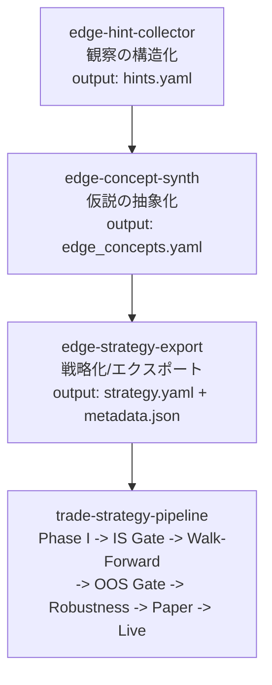
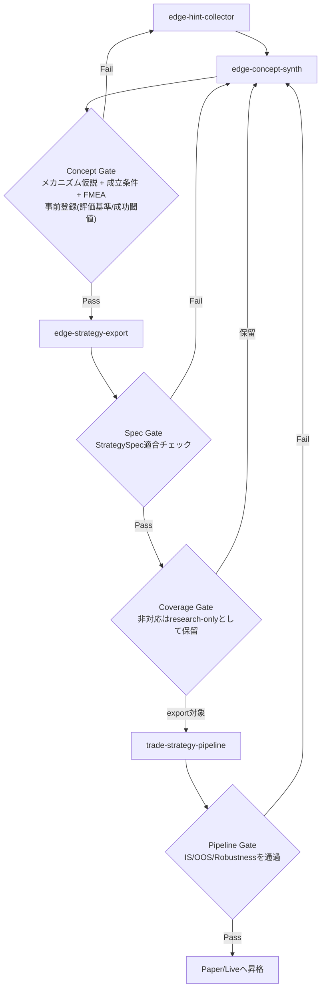
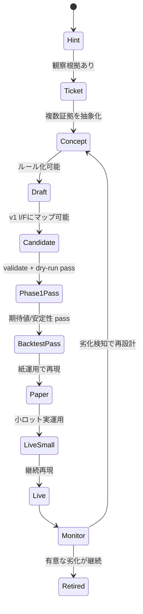
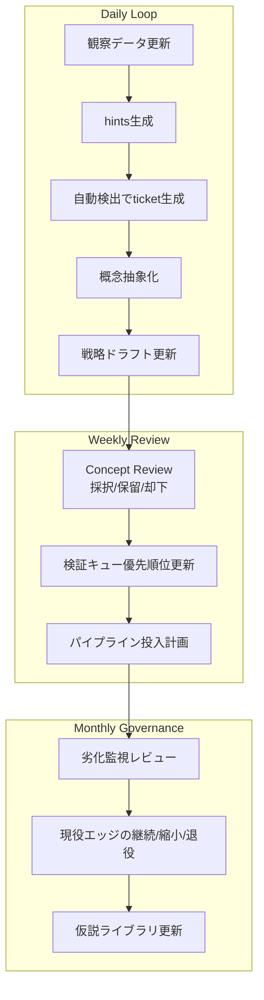

# エッジのインスティチューション化プロセス

日々の「思いつき」を、属人的なメモで終わらせず、再現可能な戦略資産に昇格させるための標準フロー。

## 目的

- 観察 -> 抽象化 -> 戦略化 -> パイプライン検証を分業化する
- 各段階で「進級ゲート」を定義し、品質を揃える
- エッジの生成と劣化監視を同じ運用系に載せる

## 1. 3スキル構成 + パイプライン接続

### 1-1. メインライン

### 1-2. 差し戻しループ（ゲート運用）

### 1-3. 実装マッピング（現リポジトリ）

| 論理スキル名 | 現在の実装 |
|---|---|
| edge-hint-collector | `skills/edge-hint-extractor` |
| edge-concept-synth | `skills/edge-concept-synthesizer` |
| edge-strategy-export | `skills/edge-strategy-designer` + `skills/edge-candidate-agent` (`export_candidate.py` / `validate_candidate.py`) |

## 2. エッジの進級ステート（進学モデル）

## 3. 日次/週次の運用リズム

## 4. 進級ゲートの最小要件

| ゲート | 最小要件 | 失格条件 |
|---|---|---|
| Concept Gate | thesis + invalidation_signals が明示されている | 仮説が観察の言い換えのみ |
| Draft Gate | entry/exit/risk/cost が定義済み | コスト未考慮、実装不能条件 |
| Pipeline Gate | `edge-finder-candidate/v1` 契約を満たす | schema違反、dry-run失敗 |
| Promotion Gate | OOSで再現し、劣化監視可能 | 特定期間のみ有効、容量不足 |

## 5. まず見るべきポイント

1. `edge_concepts.yaml` の `abstraction.thesis` と `invalidation_signals`
2. `strategy_drafts/*.yaml` の `risk` と `validation_plan`
3. `validate_candidate.py` 結果（I/F適合）
4. パイプライン結果の再現性（期間分割・レジーム分割）
