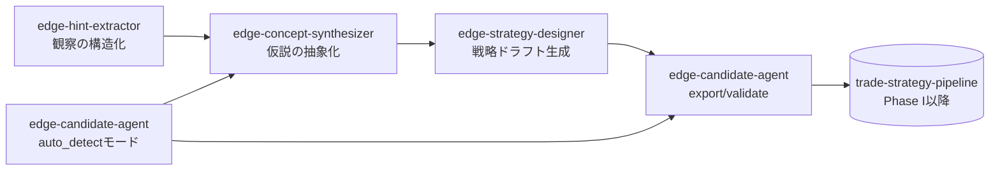
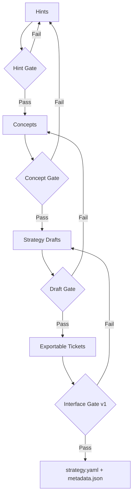

# 米国株エッジ創出エージェント設計（実装反映版）

## 0. 目的
日次の観察データから、
**「再現可能なエッジ仮説」を継続生成し、戦略ネタ（strategy draft）までを安定供給する**
運用系を、現行の4スキル実装に合わせて再設計する。

- 対象市場：米国株（ロング中心）
- 主ホライズン：数日〜数週間（研究テーマによっては60営業日）
- 本設計のゴール：
  1) 観察を `hints.yaml` に構造化
  2) チケット群を `edge_concepts.yaml` に抽象化
  3) 概念を `strategy_drafts/*.yaml` に戦略化
  4) export可能案を `ticket -> strategy.yaml + metadata.json` へ昇格可能にする

> 旧 `docs/edge_candidate_agent_design.md` は構想段階の単一エージェント前提。
> 本書は、実装済みの分割アーキテクチャ（4スキル）に対応した運用設計である。

---

## 1. スコープ
### 1.1 In Scope
- 日次EOD観察からのエッジ仮説生成
- 仮説の抽象化（メカニズム仮説 + 失効シグナル）
- 戦略ドラフト化（複数バリアント）
- `edge-finder-candidate/v1` 互換候補への変換準備

### 1.2 Out of Scope
- 本番執行（発注/約定管理）
- 完全自動の採用判断（最終採択は人間レビューを残す）
- v1未対応シグナルの自動strategy export（research-onlyとして保持）

---

## 2. 設計原則
1. 観察と戦略実装を直結させない（抽象化レイヤー必須）
2. 「説明可能性」を保持する（`thesis` / `invalidation_signals` を必須化）
3. export可能性を明示分離する（`export_ready_v1` と `research_only`）
4. 相場環境依存を前提化する（`regime` を全段で保持）
5. 日次で回し、週次で選別し、月次で劣化監視する

---

## 3. システム全体像（4スキル分割）



- 主系（推奨）：`Hint -> Concept -> Draft -> Export/Validate`
- 近道（補助）：`auto_detect_candidates.py` でチケットを自動生成し、概念化へ流す

---

## 4. 各スキルの責務とI/O

| スキル | 主責務 | 主入力 | 主出力 |
|---|---|---|---|
| `edge-hint-extractor` | 観察データをヒント化 | `market_summary.json`, `anomalies.json`, `news_reactions.*`(任意) | `hints.yaml` |
| `edge-concept-synthesizer` | チケット群を概念クラスタに抽象化 | `tickets/**/*.yaml`, `hints.yaml`(任意) | `edge_concepts.yaml` |
| `edge-strategy-designer` | 概念を戦略ドラフトへ変換 | `edge_concepts.yaml` | `strategy_drafts/*.yaml`, `run_manifest.json`, `exportable_tickets/*.yaml`(任意) |
| `edge-candidate-agent` | 検出/チケット化/export/契約検証 | `ohlcv.parquet`, `hints.yaml`(任意), `ticket.yaml` | `daily_report.md`, `tickets/*`, `strategies/<id>/strategy.yaml`, `metadata.json` |

---

## 5. データ契約（現行実装ベース）

### 5.1 Hint 契約 (`hints.yaml`)
必須最小は `hints: []`。各 hint は以下を推奨。

- `title`
- `observation`
- `preferred_entry_family`（任意、`pivot_breakout` / `gap_up_continuation`）
- `symbols`（任意）
- `regime_bias`（任意）
- `mechanism_tag`（任意）

### 5.2 Concept 契約 (`edge_concepts.yaml`)
クラスタキーは実装上 `hypothesis_type x mechanism_tag x regime`。

必須運用項目：
- `abstraction.thesis`
- `abstraction.invalidation_signals`
- `strategy_design.recommended_entry_family`
- `strategy_design.export_ready_v1`

### 5.3 Strategy Draft 契約 (`strategy_drafts/*.yaml`)
- `variant`: `core` / `conservative` / `research_probe`
- `entry_family`: exportable なら `pivot_breakout` or `gap_up_continuation`、非対応は `research_only`
- `risk_profile`: `conservative|balanced|aggressive` を保持（トレーサビリティ用）
- `validation_plan` を全draftに付与

### 5.4 Export Ticket 契約（candidate-agent投入用）
- 必須：`id`, `hypothesis_type`, `entry_family`
- `entry_family` は v1で **2種類のみ**
  - `pivot_breakout`
  - `gap_up_continuation`

### 5.5 Pipeline IF v1 契約（strategy.yaml）
`candidate_contract.py` に準拠。特に以下がゲート。

- required top keys: `id,name,universe,signals,risk,cost_model,validation,promotion_gates`
- Phase I制約：
  - `validation.method == full_sample`
  - `validation.oos_ratio` は未設定 or `null`
- エントリー別必須ブロック：
  - `pivot_breakout -> vcp_detection`
  - `gap_up_continuation -> gap_up_detection`

---

## 6. 処理フロー詳細

### 6.1 Stage A: Hint Extraction（観察の構造化）
実装：`skills/edge-hint-extractor/scripts/build_hints.py`

入力ソース：
- 市場サマリ（任意）
- 異常検知（任意）
- ニュース反応（任意）
- LLM補助（任意、`--llm-ideas-cmd`）

ロジック要点：
- regime推定（`RiskOn/RiskOff/Neutral`）
- anomaly/news をルールベースで hint 化
- LLM hint を受け取り、スキーマ正規化
- 重複排除して `max_total_hints` で制限

期待成果：
- downstreamが再利用可能な観察コンテキストを毎日生成

### 6.2 Stage B: Concept Synthesis（仮説の抽象化）
実装：`skills/edge-concept-synthesizer/scripts/synthesize_edge_concepts.py`

ロジック要点：
- ticketをクラスタ化（`hypothesis_type/mechanism/regime`）
- support統計作成（`ticket_count`, `avg_priority_score`, symbol分布）
- `thesis` / `invalidation_signals` を明示
- entry family分布から `recommended_entry_family` を決定
- v1 export可否を `export_ready_v1` として明示

期待成果：
- 過学習を避けた「概念単位レビュー」の土台を作る

### 6.3 Stage C: Strategy Design（戦略ネタ化）
実装：`skills/edge-strategy-designer/scripts/design_strategy_drafts.py`

ロジック要点：
- exportable概念は `core + conservative` を生成
- non-exportable概念は `research_probe` を生成
- risk profileで `risk_per_trade`, `max_positions` を調整
- 任意で `exportable_tickets/*.yaml` を吐く

期待成果：
- 概念から検証可能な戦略ネタを複数案で供給

### 6.4 Stage D: Candidate Agent（検出/輸出/検証）
実装：
- 検出: `auto_detect_candidates.py`
- export: `export_candidate.py`
- validate: `validate_candidate.py`

モード1: Auto-detect（観察起点）
- OHLCVから特徴量作成・regime判定・anomaly検出
- exportable候補（breakout/gap）と research-only候補（panic_reversal等）を分離出力

モード2: Export/Validate（設計起点）
- `exportable_tickets` を `strategy.yaml + metadata.json` へ変換
- `edge-finder-candidate/v1` 契約検証
- 任意で `--pipeline-root` 連携し `uv run` でschema/stage検証

---

## 7. 候補タイプの扱い方針（v1前提）

### 7.1 Export対象（即戦略化可）
- `breakout` -> `pivot_breakout`
- `earnings_drift` -> `gap_up_continuation`

### 7.2 Research-only（概念資産として蓄積）
- `panic_reversal`
- `regime_shift`
- `sector_x_stock`
- `calendar_anomaly`
- `news_reaction`
- `futures_trigger`

> 研究候補は捨てない。
> `edge_concepts.yaml` と `strategy_drafts(research_probe)` で維持し、I/F拡張時に再昇格する。

---

## 8. 進級ゲート（運用品質）



### 8.1 Gate定義
- Hint Gate
  - 入力欠損や重複でヒント品質が劣化していない
- Concept Gate
  - `thesis` と `invalidation_signals` が明示
  - supportが最低閾値以上（`--min-ticket-support`）
- Draft Gate
  - `entry/exit/risk/validation_plan` が埋まっている
- Interface Gate
  - `validate_ticket_payload` と `validate_interface_contract` を通過

---

## 9. 日次オーケストレーション仕様

### 9.1 標準フロー（推奨）
1. `edge-candidate-agent` auto detectで `market_summary/anomalies/tickets` を更新
2. `edge-hint-extractor` で `hints.yaml` を更新（ルール + 必要ならLLM）
3. `edge-concept-synthesizer` で `edge_concepts.yaml` 作成
4. `edge-strategy-designer` で `strategy_drafts` と `exportable_tickets` 作成
5. `edge-candidate-agent` export/validateで手前ゲートを通す

注記（運用方針）：
- 日次運用は **1パス**（hintsは概念化入力として使用）
- 同日中に `auto_detect_candidates.py` を `--hints` で再実行しない

### 9.2 代表コマンド
```bash
# 1-pass運用: detectorは先に1回のみ実行（hints反映のための再実行はしない）

# 1) detector
python3 skills/edge-candidate-agent/scripts/auto_detect_candidates.py \
  --ohlcv data/us_ohlcv.parquet \
  --output-dir reports/edge_candidate_auto \
  --top-n 12 --top-research-n 10

# 2) hints
python3 skills/edge-hint-extractor/scripts/build_hints.py \
  --market-summary reports/edge_candidate_auto/market_summary.json \
  --anomalies reports/edge_candidate_auto/anomalies.json \
  --output reports/edge_hints/hints.yaml

# 3) concepts
python3 skills/edge-concept-synthesizer/scripts/synthesize_edge_concepts.py \
  --tickets-dir reports/edge_candidate_auto/tickets \
  --hints reports/edge_hints/hints.yaml \
  --output reports/edge_concepts/edge_concepts.yaml \
  --min-ticket-support 2

# 4) drafts
python3 skills/edge-strategy-designer/scripts/design_strategy_drafts.py \
  --concepts reports/edge_concepts/edge_concepts.yaml \
  --output-dir reports/edge_strategy_drafts \
  --exportable-tickets-dir reports/edge_strategy_drafts/exportable_tickets \
  --risk-profile balanced

# 5) export/validate
python3 skills/edge-candidate-agent/scripts/export_candidate.py \
  --ticket reports/edge_strategy_drafts/exportable_tickets/<ticket>.yaml \
  --strategies-dir /path/to/trade-strategy-pipeline/strategies

python3 skills/edge-candidate-agent/scripts/validate_candidate.py \
  --strategy /path/to/trade-strategy-pipeline/strategies/<id>/strategy.yaml
```

---

## 10. スコアリングと優先度運用

### 10.1 実装上の優先度
- detectorは `priority_score`（0-100）で候補をランキング
- hint一致でスコアを加点（symbol一致で強加点）
- ATR過大はペナルティ

### 10.2 運用上の優先順位軸
- `priority_score`（効果の強さ）
- `support.ticket_count`（再現頻度）
- `export_ready_v1`（即検証可能性）
- `regime` との整合（現局面適合）

---

## 11. 週次・月次運用

### 11.1 Weekly Review
- `edge_concepts.yaml` 採択/保留/却下
- `strategy_drafts` の上位案を検証キューへ
- research-onlyテーマの再優先順位付け

### 11.2 Monthly Governance
- export候補の通過率（Draft -> Interface）
- 概念ごとの失効シグナル発火頻度
- regime別の候補品質変化

---

## 12. エラー処理とフォールバック
- optional入力不足は処理継続し、`skipped_modules` に記録
  - `news_reaction(no_input)`
  - `futures_trigger(no_input)`
- pipeline連携が無くても interface検証までは実行可能
- LLM連携失敗時は rule-based hints のみで継続

---

## 13. ディレクトリ標準案

```text
reports/
  edge_candidate_auto/
    market_summary.json
    anomalies.json
    watchlist.csv
    daily_report.md
    tickets/
      exportable/*.yaml
      research_only/*.yaml
  edge_hints/
    hints.yaml
  edge_concepts/
    edge_concepts.yaml
  edge_strategy_drafts/
    run_manifest.json
    *.yaml
    exportable_tickets/*.yaml
```

---

## 14. KPI（運用健全性）
1. 日次：`concept_count`, `draft_count`, `exportable_ticket_count`
2. 週次：Concept採択率、Draft差し戻し率
3. 月次：Interface Gate通過率、research-onlyの再昇格件数
4. 補助：同一conceptの継続期間、失効シグナル発火回数

---

## 15. MVP（最小運用）
1. detector + hints + concept + drafts の4段を日次で実行
2. `min-ticket-support=2` でノイズ概念を抑制
3. risk profileは `balanced` 固定から開始
4. exportは `pivot_breakout` / `gap_up_continuation` のみ
5. 週1で採択会議、月1で失効監視

---

## 16. 今後拡張（実装ロードマップ）
- v2 I/Fで `panic_reversal`, `regime_shift`, `sector_x_stock` を段階的export対応
- Concept段で regime分解統計（RiskOn/Neutral/RiskOff別支持率）を標準出力
- Draft段で容量・流動性制約を定量化した validation_plan 自動強化
- hint生成にニュース要約/イベント分類器を導入し観察品質を向上

---

## 付録A: 役割分担の要点
- `edge-hint-extractor`: 観察のノイズを減らしてヒントに整形
- `edge-concept-synthesizer`: チケットを概念資産に昇格
- `edge-strategy-designer`: 概念を比較可能な戦略ネタへ展開
- `edge-candidate-agent`: 自動検出とv1契約への出口管理

この4分割により、
「思いつき」を直接strategy化するのではなく、
**観察資産 -> 概念資産 -> 戦略資産** の順で制度化できる。
